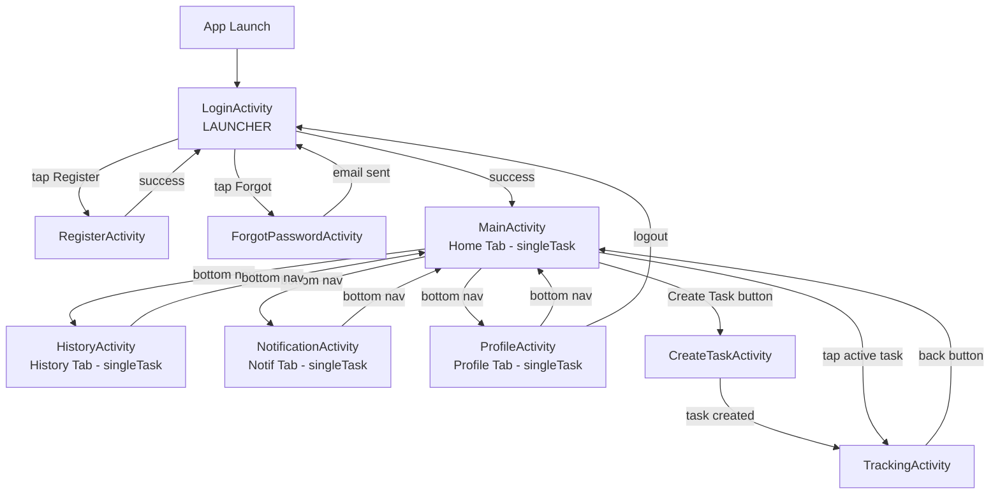
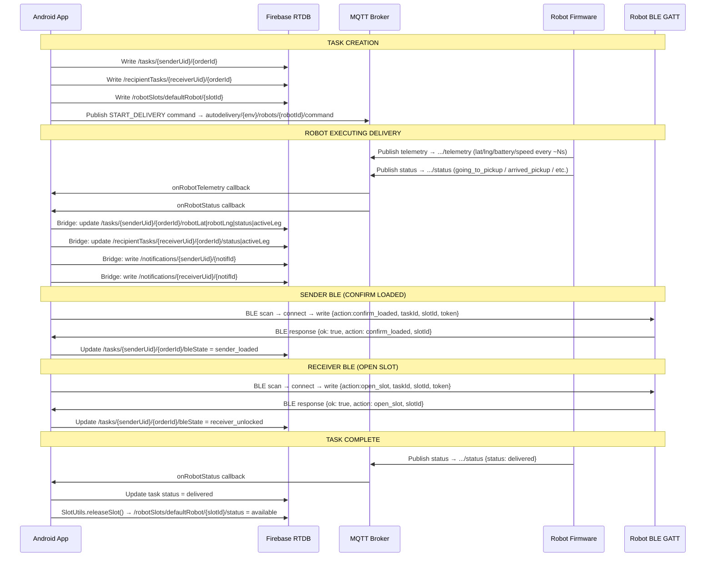

# APP ARCHITECTURE — CURRENT
> Generated: 2026-07-02 | Source: source code only  
> Do NOT use docs/archive as reference for current architecture.

---

## 1. Overall Architecture

AutoDeliveryApp is a single-module Android Native Java app (no MVVM/MVP framework). It uses a direct Activity → Firebase/MQTT pattern with a client-side bridge.

```
┌─────────────────────────────────────────────────────────────┐
│                     Android App (Client)                    │
│                                                             │
│  ┌──────────┐   ┌───────────┐   ┌────────────────────────┐ │
│  │  Firebase │   │   MQTT    │   │         BLE            │ │
│  │   Auth   │   │  Manager  │   │      (BleManager)       │ │
│  │  RTDB    │   │(Singleton)│   │  Robot GATT peripheral  │ │
│  │   FCM    │   │           │   │                        │ │
│  └──────────┘   └─────┬─────┘   └────────────────────────┘ │
│        │              │                                     │
│        │      MqttFirebaseBridge                           │
│        │      (client-side bridge)                         │
│        └──────────────┴──────────────────────────────────→ │
│                   Firebase RTDB                             │
└─────────────────────────────────────────────────────────────┘
```

**Key architectural decisions:**
- **No backend server** — MQTT bridge runs client-side inside the app
- **Firebase RTDB** is the single persistent state store
- **OSRM** (public API) provides road routing; Haversine is fallback
- **MapLibre** (self-hosted OSM tiles from MapTiler Cloud) provides map rendering
- **BLE** operates independently: app scans → connects → writes → reads response
- **FCM** is token-only client side; real push requires Cloud Functions (not yet implemented)

---

## 2. Package Structure

```
com.example.autodeliveryapp/
├── [root]              Activities + Constants + EdgeToEdgeHelper + FCMNotificationService
├── adapters/           RecyclerView adapters (ActiveTask, History, Notification)
├── ble/                BLE subsystem (Manager, GattClient, Protocol, Constants, Permissions, Token)
├── data/               Data POJOs for RecyclerView items (HistoryItem, NotificationItem)
├── model/              MQTT message POJOs (RobotTelemetry, RobotStatusMessage, RobotAck, RobotCommand)
├── mqtt/               MQTT subsystem (Manager, Config, Topics, PayloadParser, FirebaseBridge, Listener)
└── utils/              Utilities (TaskStatus, SlotUtils, NotificationUtils, PhoneUtils)
```

---

## 3. Activity Navigation Diagram



_Bottom nav activities use `singleTask` launch mode to prevent stack buildup._

---

## 4. Data Flow Diagram — App ↔ Firebase ↔ MQTT ↔ Robot ↔ BLE



---

## 5. Role Summary

| Component | Role | Implemented |
|-----------|------|-------------|
| **Auth** | Firebase Auth email+password and phone OTP | ✅ |
| **Create Task** | Form + local address lookup + OSRM route + slot booking + Firebase write + MQTT publish | ✅ |
| **Tracking** | Firebase listener + MQTT telemetry/status/ack + BLE action + MapLibre C→A→B | ✅ |
| **History** | Read delivered tasks from Firebase | ✅ |
| **Notification** | Read Firebase /notifications/{uid} | ✅ |
| **Profile / Logout** | Show user info, Firebase Auth sign out | ✅ |
| **MQTT** | HiveMQ client singleton, subscribe to robot topics, dispatch to listener | ✅ |
| **BLE** | Scan + connect + GATT write/read for sender confirm and receiver unlock | ✅ |
| **Firebase RTDB** | All persistent state: tasks, users, slots, notifications, recipientTasks | ✅ |
| **Firebase FCM** | Client token stored locally; push from server requires Cloud Functions | ⚠️ Partial |
| **Map / Route** | MapLibre + OSRM route (Haversine fallback), A→B preview, C→A live | ✅ |
| **Address Resolver** | Local Da Nang lookup map (25 entries) — NOT real geocoding API | ⚠️ Limited |
| **MQTT→Firebase Bridge** | Client-side bridge in MqttFirebaseBridge (risk: app must be open) | ⚠️ Risk |

---

## 6. Dependencies (from app/build.gradle.kts)

| Library | Version | Purpose |
|---------|---------|---------|
| Firebase BOM | 32.7.0 | Auth + RTDB + Messaging |
| MapLibre Android SDK | 11.0.0 | Map rendering |
| HiveMQ MQTT Client | 1.3.15 | MQTT broker connection |
| Material Components | — | UI components |
| AppCompat | — | Activity base |
| ConstraintLayout | — | Layouts |
| CircleImageView | — | Profile image |

---

## 7. Build Configuration

| Property | Value |
|----------|-------|
| compileSdk | 36 |
| minSdk | 24 |
| targetSdk | 36 |
| versionCode | 1 |
| versionName | 1.0 |
| Java source/target | 11 |
| ViewBinding | Enabled |
| BuildConfig | Enabled |
| ABI filters | armeabi-v7a, arm64-v8a, x86, x86_64 |
| Secrets source | `local.properties` → `BuildConfig` fields |
