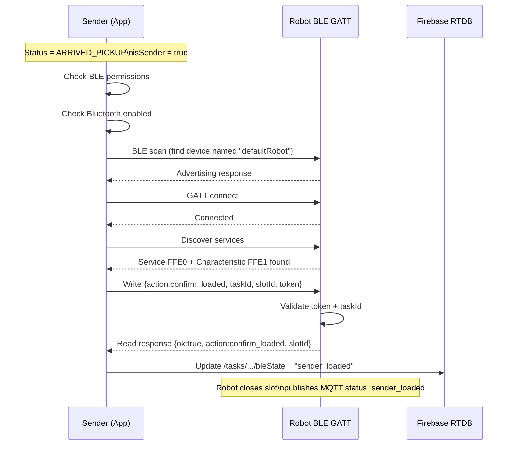
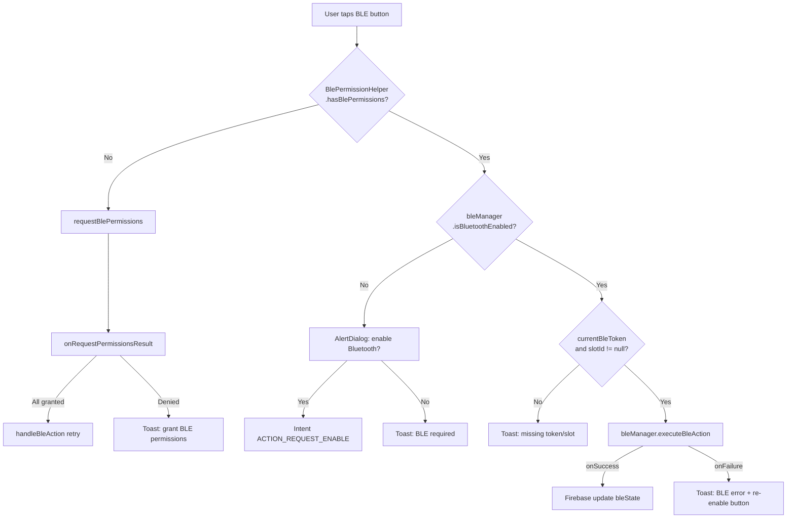

# BLE CONTRACT — CURRENT
> Generated: 2026-07-02 | Source: BleConstants.java, BleProtocol.java, BleTokenUtils.java, BleManager.java, BleGattClient.java, BlePermissionHelper.java, TrackingActivity.java

---

## 1. Purpose of BLE

BLE is used for **physical authentication** between the Android app and the robot at two key moments:
1. **Sender confirms goods loaded** — after robot arrives at pickup point A
2. **Receiver unlocks slot** — after robot arrives at dropoff point B

BLE ensures the person physically present at the robot is authorized (holds the correct token).

---

## 2. BLE Token

- **Format**: 32-character hexadecimal string (128-bit entropy)
- **Generation**: `BleTokenUtils.generateToken()` using `SecureRandom`
- **When generated**: `CreateTaskActivity.confirmTask()` when task is created
- **Where stored**:
  - Firebase `/tasks/{senderUid}/{orderId}/bleToken`
  - MQTT command payload field `bleToken` (sent to robot)
- **Who uses it**: App includes token in BLE request; Robot validates against stored token
- **Security**: Client-side generation — token is demo-grade security. Not rotated between sender and receiver use.

---

## 3. BLE UUIDs (Service and Characteristic)

From `BleConstants.java`:

| UUID | Value |
|------|-------|
| `SERVICE_UUID` | `0000FFE0-0000-1000-8000-00805F9B34FB` |
| `CHARACTERISTIC_UUID` | `0000FFE1-0000-1000-8000-00805F9B34FB` |
| `GATT_TIMEOUT_MS` | 10000 ms (10 seconds) |

**Note**: These are "demo" UUIDs (FFE0/FFE1 are commonly used in HM-10 BLE modules). Robot firmware must advertise `SERVICE_UUID` for the app to discover it.

---

## 4. Robot Discovery

`BleManager` scans for a BLE device whose name matches `robotId` (e.g., `"defaultRobot"`).  
Discovery is based on **device name matching** — the robot must advertise with the correct name.

If no matching device is found within the scan timeout → `BleActionCallback.onFailure()`.

---

## 5. Permission Flow

From `BlePermissionHelper.java`:

| Permission | API Level | Required For |
|-----------|-----------|-------------|
| `BLUETOOTH` | ≤30 | Legacy BLE |
| `BLUETOOTH_ADMIN` | ≤30 | Legacy BLE admin |
| `BLUETOOTH_SCAN` | 31+ | Scanning for devices |
| `BLUETOOTH_CONNECT` | 31+ | Connecting to devices |
| `ACCESS_FINE_LOCATION` | ≤30 | Required for BLE scan on older APIs |

Request code: `BlePermissionHelper.REQUEST_CODE_BLE_PERMISSIONS`

Manifest also includes:  
`<uses-feature android:name="android.hardware.bluetooth_le" android:required="false" />`  
_(Not required — allows install on non-BLE devices)_

---

## 6. Sender Confirm-Loaded Flow

**Triggered when**: Status = `ARRIVED_PICKUP` or `WAITING_SENDER_LOAD` AND `isSender == true`  
**Button text**: `"Đã đặt hàng vào kho chứa"` (Vietnamese UI)  
**BLE Action**: `BleConstants.ACTION_CONFIRM_LOADED` = `"confirm_loaded"`

### Request JSON sent to robot:
```json
{
  "action": "confirm_loaded",
  "taskId": "RBT-XXXX",
  "slotId": "slot1",
  "token": "a3f9...32hexchars...",
  "timestamp": 1719888000000
}
```

### Expected response from robot:
```json
{
  "ok": true,
  "action": "confirm_loaded",
  "slotId": "slot1",
  "error": ""
}
```

### On Success:
- `TrackingActivity.handleBleAction()` → `onSuccess()` callback
- Firebase write: `/tasks/{senderUid}/{orderId}/bleState` = `"sender_loaded"`
- Robot should then publish MQTT status `sender_loaded` or `picked_up`

---

## 7. Receiver Open-Slot Flow

**Triggered when**: Status = `ARRIVED_DROPOFF` or `WAITING_RECEIVER_UNLOCK` AND `isSender == false`  
**Button text**: `"Mở khoang hàng"` (Vietnamese UI)  
**BLE Action**: `BleConstants.ACTION_OPEN_SLOT` = `"open_slot"`

### Request JSON sent to robot:
```json
{
  "action": "open_slot",
  "taskId": "RBT-XXXX",
  "slotId": "slot1",
  "token": "a3f9...32hexchars...",
  "timestamp": 1719888000000
}
```

### Expected response from robot:
```json
{
  "ok": true,
  "action": "open_slot",
  "slotId": "slot1",
  "error": ""
}
```

### On Success:
- `TrackingActivity.handleBleAction()` → `onSuccess()` callback
- Firebase write: `/tasks/{senderUid}/{orderId}/bleState` = `"receiver_unlocked"`
- Robot should open the slot lid and publish MQTT status `delivered`

---

## 8. BLE State Machine (bleState field in Firebase)

| bleState | Meaning |
|----------|---------|
| `created` | Task created, BLE not yet used |
| `sender_loaded` | Sender confirmed goods loaded via BLE |
| `receiver_unlocked` | Receiver unlocked slot via BLE |

---

## 9. Robot Firmware Requirements

The robot BLE peripheral must:
1. Advertise with device name matching `robotId` (e.g., `"defaultRobot"`)
2. Expose service `0000FFE0-0000-1000-8000-00805F9B34FB`
3. Expose writable characteristic `0000FFE1-0000-1000-8000-00805F9B34FB`
4. Accept JSON write: `{action, taskId, slotId, token, timestamp}`
5. Validate `token` matches stored `bleToken` (received via MQTT command)
6. Validate `taskId` matches current task
7. Respond with JSON: `{ok: true/false, action, slotId, error}`
8. On `confirm_loaded` success: signal robot to close slot and proceed
9. On `open_slot` success: physically open slot lid

---

## 10. BLE Sender Confirm-Loaded Sequence



---

## 11. BLE Receiver Open-Slot Sequence


---

## 12. BLE Permission Flow



---

## 13. Risks

| Risk | Impact | Mitigation |
|------|--------|-----------|
| Robot not advertising correct UUID | BLE scan fails, user cannot confirm/receive | Robot firmware must match UUID |
| Robot name mismatch | Scan finds no device | Robot must be named exactly `robotId` |
| BLE token single-use not enforced | Token can be reused (sender uses it, robot keeps accepting) | Robot firmware should invalidate token after use |
| BLE range (~10m) | User must be physically near robot | By design |
| Bluetooth disabled | Dialog shown, user must enable manually | Handled by AlertDialog |
| Permission denial | Cannot scan | Permission request handled; toast if denied |
| App uses same token for both sender + receiver | Sender token exposure risk to receiver | Design limitation — token is shared via Firebase for receiver |
