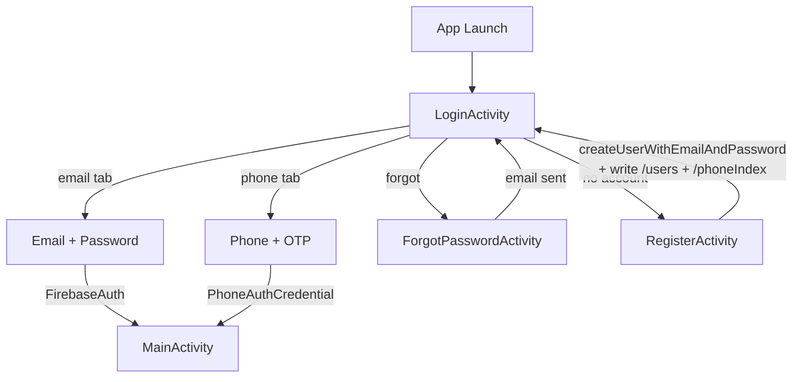
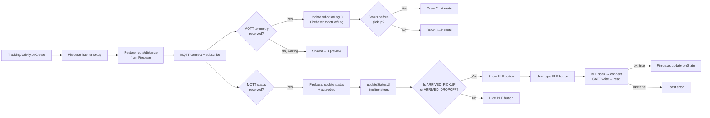
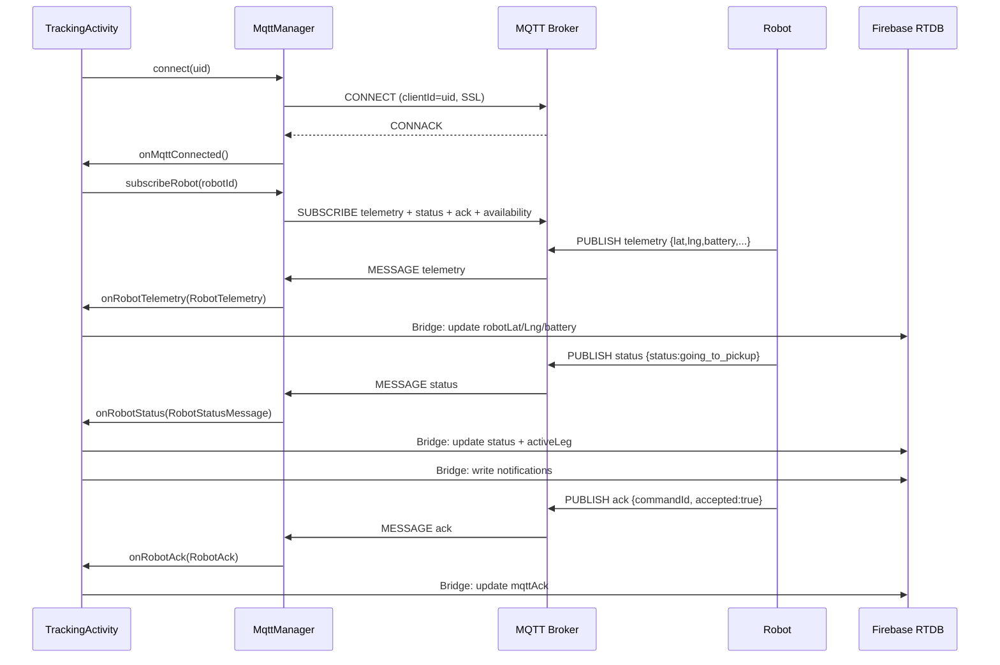
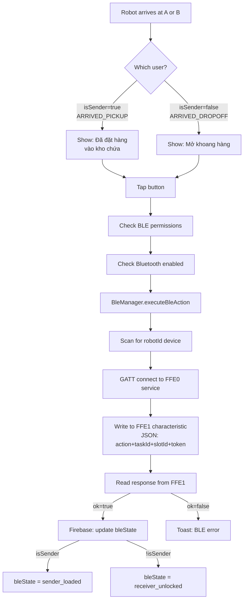

# FEATURES AND FLOWS — CURRENT
> Generated: 2026-07-02 | Source: source code only

---

## AUTH FLOWS

### Feature: Register
- **Purpose**: Create new user account
- **Entry screen**: `RegisterActivity` (from LoginActivity)
- **Implemented files**: `RegisterActivity.java`, `activity_register.xml`, `PhoneUtils.java`
- **Step-by-step flow**:
  1. User enters: display name, email, password, phone number
  2. `PhoneUtils.normalizePhone()` normalizes phone to E.164
  3. `FirebaseAuth.createUserWithEmailAndPassword()` creates account
  4. On success: write to `/users/{uid}` (username, phone, email)
  5. Write to `/phoneIndex/{phoneNormalized}` = uid (for receiver lookup)
  6. Navigate back to LoginActivity
- **Firebase nodes**: `/users/{uid}`, `/phoneIndex/{phoneNormalized}`
- **MQTT/BLE**: None
- **Runtime risks**: Phone normalization edge cases; duplicate phone registration possible if rules allow

---

### Feature: Login (Email)
- **Purpose**: Authenticate existing user
- **Entry screen**: `LoginActivity` (LAUNCHER)
- **Implemented files**: `LoginActivity.java`, `activity_login.xml`
- **Step-by-step flow**:
  1. User enters email + password
  2. `FirebaseAuth.signInWithEmailAndPassword()`
  3. On success: navigate to `MainActivity`
- **Firebase nodes**: Firebase Auth
- **MQTT/BLE**: None

---

### Feature: Login (Phone OTP)
- **Purpose**: Alternative phone-based login
- **Entry screen**: `LoginActivity` (phone tab)
- **Implemented files**: `LoginActivity.java`
- **Step-by-step flow**:
  1. User enters phone number
  2. `PhoneAuthProvider.verifyPhoneNumber()` sends OTP
  3. User enters OTP code
  4. `PhoneAuthCredential` used to sign in
  5. On success: navigate to `MainActivity`
- **Firebase nodes**: Firebase Auth
- **MQTT/BLE**: None
- **Runtime risks**: Firebase phone auth requires Google Play Services and proper SHA fingerprint in Firebase console

---

### Feature: Forgot Password
- **Purpose**: Reset password via email
- **Entry screen**: `ForgotPasswordActivity`
- **Implemented files**: `ForgotPasswordActivity.java`, `activity_forgot_password.xml`
- **Step-by-step flow**:
  1. User enters email
  2. `FirebaseAuth.sendPasswordResetEmail()`
  3. Toast confirmation
  4. Return to LoginActivity
- **Firebase nodes**: Firebase Auth

---

## AUTH FLOW DIAGRAM



---

## CREATE TASK FLOW

### Feature: Create Task
- **Purpose**: Create a new delivery task, book a robot slot, publish MQTT command
- **Entry screen**: `CreateTaskActivity` (from MainActivity)
- **Implemented files**: `CreateTaskActivity.java`, `activity_create_task.xml`, `MqttManager.java`, `MqttPayloadParser.java`, `BleTokenUtils.java`, `SlotUtils.java`, `PhoneUtils.java`, `NotificationUtils.java`
- **Step-by-step flow**:
  1. Pre-fill sender name + phone from Firebase `/users/{uid}`
  2. User enters: receiver name, receiver phone, pickup address, dropoff address
  3. Address watcher triggers on text change (600ms debounce)
  4. `getCoordinates()` resolves pickup + dropoff via `Constants.DA_NANG_LOCATIONS` local lookup
  5. `fetchOsrmRoute(A, B)` → distance km + ETA + GeoJSON route
  6. If OSRM fails → `handleOsrmFallback()` → Haversine distance + straight line GeoJSON
  7. Map draws A→B route (blue polyline, green/red circle markers)
  8. User selects slot (slot1/slot2/slot3) from real-time Firebase slot status
  9. User taps Confirm:
     - Validate all fields + simulatedDistance > 0 + slot selected
     - `PhoneUtils.normalizePhone(receiverPhone)` → receiverPhoneNormalized
     - Generate `orderId = "RBT-" + random 4 digits`
     - Generate `commandId = UUID`
     - Generate `bleToken = BleTokenUtils.generateToken()` (128-bit hex)
     - Firebase **Transaction** on `/robotSlots/defaultRobot/{slotId}`: available → occupied
     - On transaction success: write `/tasks/{senderUid}/{orderId}` (all fields)
     - Send sender notification (task_created)
     - Lookup `/phoneIndex/{receiverPhoneNormalized}` → receiverUid
     - Write `/recipientTasks/{receiverUid}/{orderId}`
     - Send receiver notification (incoming_delivery)
     - Publish MQTT START_DELIVERY command
  10. Navigate to `TrackingActivity`
- **Firebase nodes**: `/users/{uid}`, `/phoneIndex`, `/tasks`, `/recipientTasks`, `/robotSlots`, `/notifications`
- **MQTT**: Publishes START_DELIVERY to `autodelivery/{env}/robots/defaultRobot/command`
- **BLE**: Generates bleToken (stored, not used at this step)
- **Runtime risks**: OSRM unavailable → Haversine fallback; receiver phone not found → task created without recipient; slot transaction conflict → user must pick another slot

---

## CREATE TASK FLOW DIAGRAM

```mermaid
flowchart TD
    A[Open CreateTaskActivity] --> B[Pre-fill sender info from Firebase]
    B --> C[User fills form:\nreceiver + pickup + dropoff]
    C --> D{Both addresses\nresolved?}
    D -->|No| E[Show distance=placeholder\ndisable Confirm]
    D -->|Yes| F[fetchOsrmRoute A→B]
    F -->|Success| G[Draw route on map\nEnable Confirm]
    F -->|Fail| H[Haversine fallback\nStraight line]
    H --> G
    G --> I[User selects slot\nSlot status from Firebase]
    I --> J[User taps Confirm]
    J --> K{Validate all\nfields OK?}
    K -->|No| L[Toast error]
    K -->|Yes| M[Firebase Transaction\nslot available → occupied]
    M -->|Committed| N[Write /tasks/{uid}/{orderId}]
    M -->|Aborted| O[Toast: slot taken]
    N --> P[Lookup receiver phone]
    P --> Q[Write /recipientTasks]
    Q --> R[Send notifications]
    R --> S[Publish MQTT START_DELIVERY]
    S --> T[Navigate to TrackingActivity]
```

---

## TRACKING FLOW

### Feature: Tracking C→A→B
- **Purpose**: Live robot tracking with status, map, BLE actions
- **Entry screen**: `TrackingActivity` (from MainActivity task tap or CreateTask)
- **Implemented files**: `TrackingActivity.java`, `activity_tracking.xml`, `MqttFirebaseBridge.java`, `MqttManager.java`, `BleManager.java`
- **Step-by-step flow**:
  1. onCreate: reads Intent extras (orderId, pickup, dropoff, distance, robotId, slotId, senderUid, receiverUid)
  2. Sets up Firebase listener on task node (sender: `/tasks/{uid}/{orderId}`, receiver: `/recipientTasks/{uid}/{orderId}`)
  3. Firebase listener restores: status, activeLeg, bleToken, bleState, coordinates, route GeoJSON, distance, ETA, robotLat/Lng
  4. MqttManager connects (or reuses connection), subscribes to robot topics
  5. MapLibre map initializes, draws route based on Firebase data
  6. On MQTT telemetry: update robotLatLng + Firebase bridge + redraw route
  7. On MQTT status: update Firebase task status/activeLeg + update UI + send notifications
  8. On MQTT ack: update Firebase mqttAck field
  9. BLE button appears based on status + isSender:
     - Sender at ARRIVED_PICKUP: shows "Đã đặt hàng vào kho chứa"
     - Receiver at ARRIVED_DROPOFF: shows "Mở khoang hàng"
  10. BLE action: scan → connect → GATT write → read response → update Firebase bleState
- **Firebase nodes**: `/tasks`, `/recipientTasks`, `/notifications`
- **MQTT**: Subscribes to telemetry/status/ack/availability; MqttFirebaseBridge writes to Firebase
- **BLE**: BleManager executes confirm_loaded or open_slot action
- **Runtime risks**: App must be open for MQTT bridge to work; BLE requires robot nearby; Firebase listener is always-on (battery drain)

---

## TRACKING C→A→B FLOW DIAGRAM



---

## MQTT FLOW DIAGRAM



---

## BLE SENDER/RECEIVER FLOW DIAGRAM



---

## NOTIFICATION FLOW DIAGRAM

```mermaid
flowchart TD
    A[MqttFirebaseBridge\n.handleStatus] --> B{Status changed?}
    B -->|Yes| C[NotificationUtils\n.buildTitle/Message/Icon]
    C --> D[Write /notifications/{senderUid}/{notifId}]
    C --> E[Write /notifications/{receiverUid}/{notifId}]
    D --> F[NotificationActivity\nreads /notifications/{uid}]
    E --> F
    F --> G[NotificationAdapter displays\ntitle, message, time, icon, read state]

    H[FCMNotificationService] --> I[onNewToken → save to SharedPrefs]
    H --> J[onMessageReceived → show local notification]
    J --> K{Real push?\n⚠️ Requires Cloud Functions}
    K -->|Not yet implemented| L[Push not delivered]
```

---

## SLOT BOOKING FLOW DIAGRAM

```mermaid
flowchart TD
    A[User selects slot in CreateTask] --> B[loadRobotSlots listener]
    B --> C[Firebase /robotSlots/defaultRobot reads live]
    C --> D{slot status?}
    D -->|available| E[RadioButton enabled: Empty]
    D -->|occupied| F[RadioButton disabled: Full]
    E --> G[User taps Confirm]
    G --> H[Firebase Transaction\nslot: available → occupied]
    H -->|committed| I[Write task to Firebase\nPublish MQTT]
    H -->|aborted| J[Toast: slot taken\nSelect another]
    I --> K[On task delivered/cancelled\nSlotUtils.releaseSlot]
    K --> L[Firebase /robotSlots/{slotId}/status\n= available]
```
