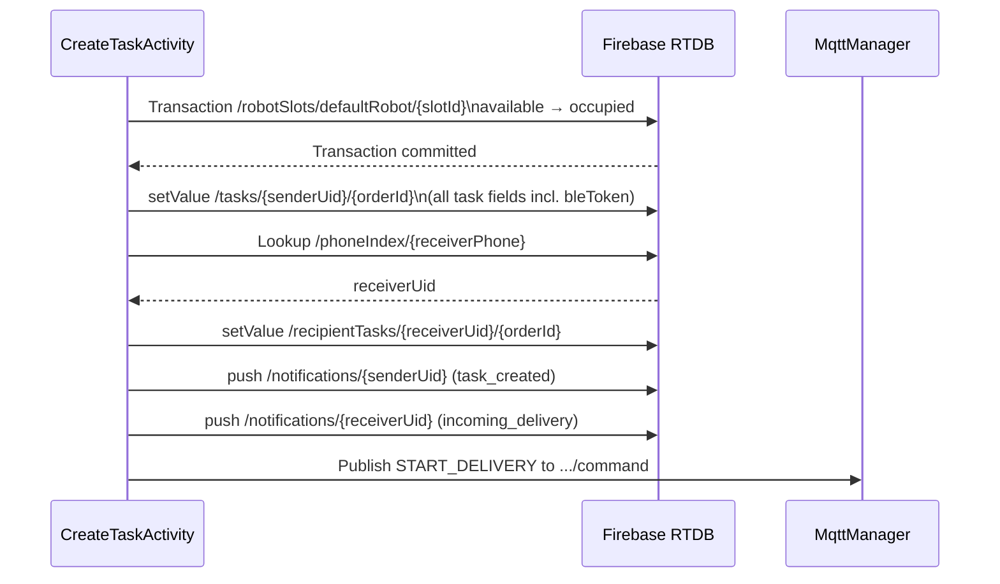

# FIREBASE SCHEMA — CURRENT
> Generated: 2026-07-02 | Source: source code only (CreateTaskActivity, TrackingActivity, MqttFirebaseBridge, SlotUtils, RegisterActivity, FCMNotificationService)  
> Firebase Rules on server: **UNKNOWN** — cannot be read without Firebase Console access.  
> Local `docs/archive/raw/FIREBASE_RULES_LOGIN_DEMO.json` is a sample only, NOT confirmed as applied.

---

## Firebase Auth

- **Provider**: Email/Password + Phone (OTP via `PhoneAuthProvider`)
- **Used in**: `LoginActivity`, `RegisterActivity`, `ForgotPasswordActivity`, `ProfileActivity`
- **UID**: Used as key for all user-scoped RTDB nodes

---

## Firebase Realtime Database Nodes

### `/users/{uid}`

| Field | Type | Purpose |
|-------|------|---------|
| `username` | String | Display name |
| `phone` | String | Raw phone (as entered) |
| `email` | String | Email address |

- **Writer**: `RegisterActivity` on registration
- **Reader**: `CreateTaskActivity.prefillUserInfo()`, `ProfileActivity`
- **Related Java**: `RegisterActivity.java`, `CreateTaskActivity.java`, `ProfileActivity.java`
- **Security risk**: Must be read-protected per UID. Anyone who can read `users` would see phone numbers.

---

### `/phoneIndex/{phoneNormalized}`

| Field | Type | Purpose |
|-------|------|---------|
| (value) | String | UID of user with this phone |

- **Writer**: `RegisterActivity` on registration (key = E.164 normalized phone)
- **Reader**: `CreateTaskActivity.lookupReceiverAndNotify()` to find receiver UID
- **Related Java**: `RegisterActivity.java`, `CreateTaskActivity.java`, `PhoneUtils.java`
- **Security risk**: Lookup by phone number could expose UIDs. Must restrict reads.

---

### `/tasks/{senderUid}/{taskId}`

The primary task record. `taskId` = `orderId` (format: `RBT-XXXX`).

| Field | Type | Purpose |
|-------|------|---------|
| `orderId` | String | Order ID (RBT-XXXX) |
| `senderName` | String | Sender display name |
| `senderPhone` | String | Sender phone (raw) |
| `receiverName` | String | Receiver display name |
| `receiverPhone` | String | Receiver phone (raw) |
| `receiverPhoneNormalized` | String | Receiver phone E.164 |
| `pickup` | String | Pickup address text |
| `dropoff` | String | Dropoff address text |
| `distance` | Double | Distance km (legacy) |
| `status` | String | Current task status (see TaskStatus) |
| `createdAt` | Long | Creation timestamp ms |
| `slotId` | String | Robot slot ID (slot1/slot2/slot3) |
| `robotId` | String | Robot ID (default: "defaultRobot") |
| `senderUid` | String | Sender Firebase UID |
| `bleToken` | String | 128-bit hex BLE auth token |
| `bleTokenCreatedAt` | Long | Token creation timestamp |
| `bleState` | String | BLE lifecycle state (created/sender_loaded/receiver_unlocked) |
| `senderLoadedConfirmed` | Boolean | Whether sender confirmed load (legacy flag) |
| `receiverUnlocked` | Boolean | Whether receiver unlocked slot (legacy flag) |
| `pickupName` | String | Pickup address name |
| `dropoffName` | String | Dropoff address name |
| `pickupLat` | Double | Pickup A latitude |
| `pickupLng` | Double | Pickup A longitude |
| `dropoffLat` | Double | Dropoff B latitude |
| `dropoffLng` | Double | Dropoff B longitude |
| `deliveryDistanceKm` | Double | A→B distance km |
| `deliveryDurationMinutes` | Int | Estimated delivery duration |
| `deliveryRouteSource` | String | "osrm" or "haversine" or "pending" |
| `deliveryRouteStatus` | String | "ok" or "fallback" or "pending" |
| `deliveryRouteGeoJson` | String | GeoJSON LineString of A→B route |
| `activeLeg` | String | Current route leg (robot_to_pickup/pickup_to_delivery/etc.) |
| `mqttEnabled` | Boolean | Whether MQTT is active for task |
| `mqttCommandId` | String | UUID of START_DELIVERY command |
| `mqttAck` | Boolean | Whether robot acknowledged command |
| `mqttAckMessage` | String | Ack message from robot |
| `lastMqttAt` | Long | Last MQTT event timestamp |
| `robotLat` | Double | Robot current lat (from telemetry) |
| `robotLng` | Double | Robot current lng (from telemetry) |
| `robotBattery` | Int | Robot battery % |
| `robotSpeed` | Double | Robot speed |
| `robotHeading` | Double | Robot heading |
| `lastTelemetrySeq` | Long | Last telemetry sequence number |
| `lastNotifiedStatus` | String | Last status for which notification was sent |

- **Writer**: `CreateTaskActivity` (initial write), `MqttFirebaseBridge` (telemetry/status/ack updates), `TrackingActivity` (bleState updates)
- **Reader**: `TrackingActivity` (Firebase listener), `MainActivity`, `HistoryActivity`
- **Related Java**: `CreateTaskActivity.java`, `TrackingActivity.java`, `MqttFirebaseBridge.java`
- **Security risk**: Contains `bleToken` — must be readable only by `senderUid`. Token exposure = unauthorized BLE access.

---

### `/recipientTasks/{receiverUid}/{taskId}`

Mirror of task for receiver. Written after successful receiver lookup.

| Field | Type | Purpose |
|-------|------|---------|
| `status` | String | Mirrored from `/tasks` by MqttFirebaseBridge |
| `activeLeg` | String | Mirrored from `/tasks` by MqttFirebaseBridge |
| `lastMqttAt` | Long | Last MQTT sync timestamp |
| *(other fields)* | — | Written by CreateTaskActivity (subset of task fields) |

- **Writer**: `CreateTaskActivity.lookupReceiverAndNotify()`, `MqttFirebaseBridge.handleStatus()`
- **Reader**: `TrackingActivity` (when `isSender == false`), `MainActivity` (receiver's active task view)
- **Related Java**: `CreateTaskActivity.java`, `MqttFirebaseBridge.java`, `TrackingActivity.java`
- **Security risk**: Receiver should only read their own `receiverUid` scope.

---

### `/notifications/{uid}/{notificationId}`

| Field | Type | Purpose |
|-------|------|---------|
| `icon` | String | Icon identifier for UI |
| `title` | String | Notification title |
| `message` | String | Notification body text |
| `time` | String | HH:mm time string |
| `orderId` | String | Task/order ID |
| `taskId` | String | Same as orderId |
| `type` | String | Status type that triggered notification |
| `read` | Boolean | Read/unread state |
| `createdAt` | ServerTimestamp | Firebase server timestamp |
| `slotId` | String | Robot slot |
| `robotId` | String | Robot ID |

- **Writer**: `MqttFirebaseBridge.sendNotification()` — writes for both sender and receiver on each status change
- **Reader**: `NotificationActivity`
- **Related Java**: `MqttFirebaseBridge.java`, `NotificationActivity.java`, `NotificationUtils.java`
- **Security risk**: Must be user-scoped read. `/notifications/{uid}` must only be readable by `uid`.

---

### `/robotSlots/{robotId}/{slotId}`

| Field | Type | Purpose |
|-------|------|---------|
| `status` | String | "available" or "occupied" |
| `taskId` | String | Task ID using this slot (or null) |
| `orderId` | String | Order ID (or null) |
| `updatedAt` | ServerTimestamp | Last update time |

- **Writer**: `CreateTaskActivity` (Transaction: available → occupied on booking), `SlotUtils.releaseSlot()` (occupied → available on terminal status)
- **Reader**: `CreateTaskActivity.loadRobotSlots()` (live listener for slot availability UI)
- **Related Java**: `CreateTaskActivity.java`, `SlotUtils.java`
- **Security risk**: Slot booking uses Firebase Transaction to prevent race conditions. Rules must allow read+write for authenticated users only.

---

## Firebase Schema Diagram

```mermaid
graph TD
    ROOT[Firebase RTDB Root]

    ROOT --> USERS[/users/{uid}/]
    ROOT --> PHONE[/phoneIndex/{phoneNormalized}/]
    ROOT --> TASKS[/tasks/{senderUid}/{taskId}/]
    ROOT --> RTASKS[/recipientTasks/{receiverUid}/{taskId}/]
    ROOT --> NOTIF[/notifications/{uid}/{notifId}/]
    ROOT --> SLOTS[/robotSlots/{robotId}/{slotId}/]

    USERS --> U1[username]
    USERS --> U2[phone]
    USERS --> U3[email]

    PHONE --> P1[uid value]

    TASKS --> T1[status + activeLeg]
    TASKS --> T2[pickup/dropoff coords + GeoJSON]
    TASKS --> T3[bleToken + bleState]
    TASKS --> T4[robotLat + robotLng + battery]
    TASKS --> T5[mqttAck + mqttCommandId]

    RTASKS --> RT1[status + activeLeg mirrored]

    NOTIF --> N1[title + message + read]

    SLOTS --> S1[status: available/occupied]
    SLOTS --> S2[taskId + orderId]
```

---

## Task Creation Write Flow



---

## Recipient Task Access Flow

```mermaid
graph TD
    A[Receiver opens app] --> B[LoginActivity → MainActivty]
    B --> C{Is receiver UID in\n/recipientTasks/{uid}?}
    C -->|Yes| D[Task appears in active task list]
    D --> E[Tap task → TrackingActivity\nisSender = false]
    E --> F[TrackingActivity reads\n/recipientTasks/{uid}/{orderId}]
    F --> G[Firebase listener: status/activeLeg]
    G --> H{Status = ARRIVED_DROPOFF\nor WAITING_RECEIVER_UNLOCK?}
    H -->|Yes| I[Show BLE open_slot button]
    H -->|No| J[Show status UI only]
    I --> K[BLE: open_slot → robot]
    K --> L[Update /tasks/{senderUid}/{orderId}/bleState\n= receiver_unlocked]
```

---

## Security Risks Summary

| Risk | Node | Severity |
|------|------|----------|
| `bleToken` readable by others | `/tasks` | HIGH |
| Phone index lookup exposes UIDs | `/phoneIndex` | MEDIUM |
| Receiver can access sender task data | `/tasks/{senderUid}` if rules permissive | HIGH |
| MQTT bridge only active when app open | All telemetry/status nodes | MEDIUM |
| Firebase Rules server state unknown | Entire RTDB | HIGH |
