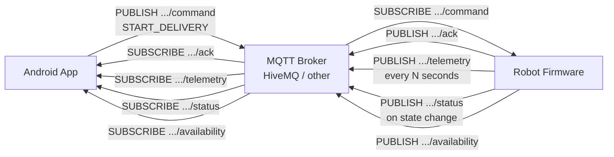
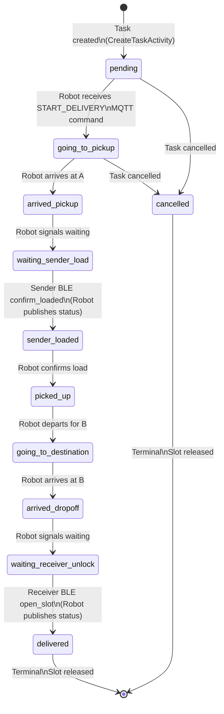

# MQTT CONTRACT — CURRENT
> Generated: 2026-07-02 | Source: MqttConfig.java, MqttTopics.java, MqttPayloadParser.java, MqttManager.java, MqttFirebaseBridge.java, model/*.java

---

## 1. MQTT Broker Configuration

Config is injected from `local.properties` at build time into `BuildConfig`, then read by `MqttConfig.java`:

| Field | Source | BuildConfig Key |
|-------|--------|-----------------|
| Host | `local.properties` → `MQTT_HOST` | `BuildConfig.MQTT_HOST` |
| Port | `local.properties` → `MQTT_PORT` (default: 8883) | `BuildConfig.MQTT_PORT` |
| Username | `local.properties` → `MQTT_USERNAME` | `BuildConfig.MQTT_USERNAME` |
| Password | `local.properties` → `MQTT_PASSWORD` | `BuildConfig.MQTT_PASSWORD` |
| Use SSL | `local.properties` → `MQTT_USE_SSL` (default: true) | `BuildConfig.MQTT_USE_SSL` |
| Environment | `local.properties` → `MQTT_ENV` (default: dev) | `BuildConfig.MQTT_ENV` |
| Default Robot ID | `local.properties` → `MQTT_DEFAULT_ROBOT_ID` (default: defaultRobot) | `BuildConfig.MQTT_DEFAULT_ROBOT_ID` |

`MqttConfig.isConfigUsable()` returns false if HOST, USERNAME, PASSWORD, or ENV is empty.

**Client library**: HiveMQ MQTT Client (`com.hivemq:hivemq-mqtt-client:1.3.15`)  
**Client ID**: Set to Firebase UID at connection time.

---

## 2. Topic Structure

Topics follow the pattern:
```
autodelivery/{env}/robots/{robotId}/{type}
```

| Topic Method | Pattern | Type |
|-------------|---------|------|
| `MqttTopics.command(robotId)` | `autodelivery/{env}/robots/{robotId}/command` | App → Robot |
| `MqttTopics.telemetry(robotId)` | `autodelivery/{env}/robots/{robotId}/telemetry` | Robot → App |
| `MqttTopics.status(robotId)` | `autodelivery/{env}/robots/{robotId}/status` | Robot → App |
| `MqttTopics.ack(robotId)` | `autodelivery/{env}/robots/{robotId}/ack` | Robot → App |
| `MqttTopics.event(robotId)` | `autodelivery/{env}/robots/{robotId}/event` | Robot → App |
| `MqttTopics.availability(robotId)` | `autodelivery/{env}/robots/{robotId}/availability` | Robot → App |

Default env: `dev`. Default robotId: `defaultRobot`.

---

## 3. Message Payloads

### 3A. START_DELIVERY Command (App → Robot)

Published to: `autodelivery/{env}/robots/{robotId}/command`  
Built by: `MqttPayloadParser.toCommandJson(RobotCommand)`

```json
{
  "commandId": "UUID",
  "command": "START_DELIVERY",
  "taskId": "RBT-XXXX",
  "orderId": "RBT-XXXX",
  "robotId": "defaultRobot",
  "slotId": "slot1",
  "pickupLat": 16.0611,
  "pickupLng": 108.2275,
  "pickupAddress": "Dragon Bridge",
  "dropoffLat": 15.9727,
  "dropoffLng": 108.2698,
  "dropoffAddress": "Marble Mountains",
  "bleToken": "a3f9...32hexchars...",
  "timestamp": 1719888000000
}
```

**Note**: `bleToken` IS sent to robot via MQTT command. Robot must store it and enforce BLE auth.

---

### 3B. Telemetry Payload (Robot → App)

Subscribed on: `autodelivery/{env}/robots/{robotId}/telemetry`  
Parsed by: `MqttPayloadParser.parseTelemetry()`  
Model: `RobotTelemetry`

```json
{
  "robotId": "defaultRobot",
  "taskId": "RBT-XXXX",
  "lat": 16.0611,
  "lng": 108.2275,
  "battery": 85,
  "speed": 1.2,
  "heading": 45.0,
  "obstacle": false,
  "timestamp": 1719888000000,
  "seq": 42
}
```

**Required fields**: `robotId` + `timestamp` (missing = message rejected)  
**Throttle**: App writes to Firebase max once per 5 seconds (`lastTelemetryWriteTime`)  
**Sequence guard**: `seq` must be greater than `lastTelemetrySeq` to be written

---

### 3C. Status Payload (Robot → App)

Subscribed on: `autodelivery/{env}/robots/{robotId}/status`  
Parsed by: `MqttPayloadParser.parseStatus()`  
Model: `RobotStatusMessage`

```json
{
  "robotId": "defaultRobot",
  "taskId": "RBT-XXXX",
  "status": "going_to_pickup",
  "slotId": "slot1",
  "message": "Robot heading to pickup point",
  "timestamp": 1719888000000
}
```

**Required fields**: `robotId` + `status` (missing = message rejected)

---

### 3D. Ack Payload (Robot → App)

Subscribed on: `autodelivery/{env}/robots/{robotId}/ack`  
Parsed by: `MqttPayloadParser.parseAck()`  
Model: `RobotAck`

```json
{
  "commandId": "UUID",
  "taskId": "RBT-XXXX",
  "robotId": "defaultRobot",
  "accepted": true,
  "message": "Command received and accepted",
  "timestamp": 1719888000000
}
```

**Alternative**: `"status": "accepted"` is also parsed (backward compat)  
**Required fields**: `commandId` + `robotId` (missing = rejected)

---

## 4. Supported Status Values

From `TaskStatus.java` — these are the canonical status strings:

| Status | Meaning | activeLeg Derived |
|--------|---------|-------------------|
| `pending` | Task created, robot not started | `robot_to_pickup` |
| `going_to_pickup` | Robot navigating to A | `robot_to_pickup` |
| `arrived_pickup` | Robot at A | `at_pickup` |
| `waiting_sender_load` | Waiting for sender BLE confirm | `at_pickup` |
| `sender_loaded` | Sender confirmed load via BLE | `pickup_to_delivery` |
| `picked_up` | Pickup confirmed | `pickup_to_delivery` |
| `going_to_destination` | Robot navigating to B | `pickup_to_delivery` |
| `arrived_dropoff` | Robot at B | `at_delivery` |
| `waiting_receiver_unlock` | Waiting for receiver BLE unlock | `at_delivery` |
| `delivered` | Delivery complete (TERMINAL) | `completed` |
| `cancelled` | Cancelled (TERMINAL) | `completed` |

`activeLeg` is derived in `MqttFirebaseBridge.deriveActiveLeg()`.

---

## 5. activeLeg Mapping

| activeLeg | Route Drawn in TrackingActivity |
|-----------|--------------------------------|
| `robot_to_pickup` | C→A (if robotLatLng available) or A→B preview |
| `at_pickup` | A→B preview (robot at A, waiting) |
| `pickup_to_delivery` | C→B (if robotLatLng available) or A→B preview |
| `at_delivery` | A→B preview (robot at B, waiting) |
| `completed` | A→B preview (terminal) |

Initial value written by `CreateTaskActivity`: `"robot_to_pickup"`

---

## 6. BLE Token in MQTT Command

- `bleToken` is a 32-char hex string generated by `BleTokenUtils.generateToken()` using 128-bit `SecureRandom`
- Generated in `CreateTaskActivity.confirmTask()` and stored in:
  - Firebase `/tasks/{senderUid}/{orderId}/bleToken`
  - MQTT command payload `bleToken` field
- **Risk**: Token is sent over MQTT to robot — MQTT broker security is critical
- Robot firmware must: store the token and validate incoming BLE requests against it

---

## 7. MQTT Flow Diagram



---

## 8. Robot Status State Transition Diagram



---

## 9. Client-Side Bridge Risk

The MQTT → Firebase bridge runs inside `MqttFirebaseBridge` which is instantiated by `TrackingActivity`:

- **Risk**: If the app is closed/backgrounded while robot is active, no telemetry/status is written to Firebase
- **Impact**: TrackingActivity will not show live robot location; status will not update in Firebase; notifications will not be sent
- **Mitigation needed**: A real backend bridge (e.g., Firebase Cloud Functions + MQTT webhook, or persistent service) should replace the client-side bridge for production
