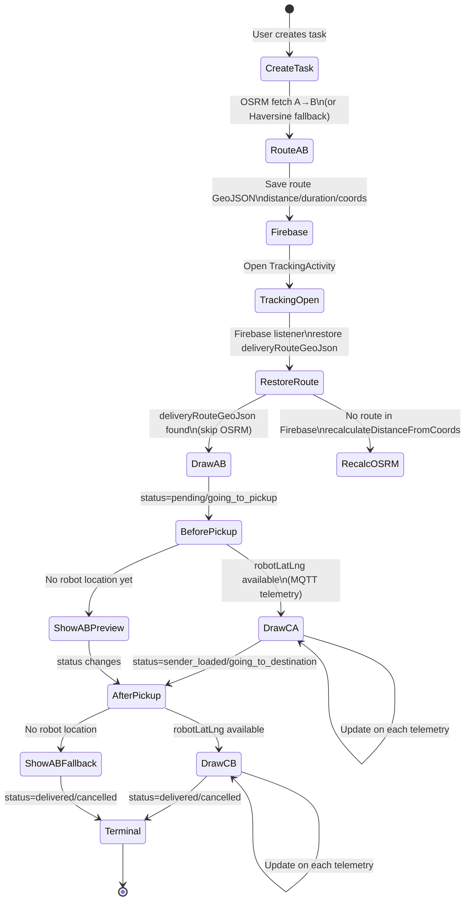
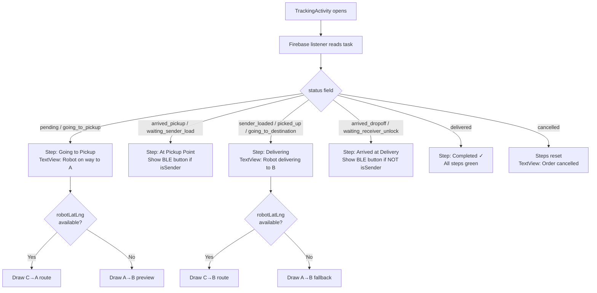

# TRACKING ROUTE CONTEXT — CURRENT
> Generated: 2026-07-02 | Source: TrackingActivity.java, CreateTaskActivity.java, MqttFirebaseBridge.java

---

## 1. Definitions: C, A, B

| Point | Variable | Meaning | Source |
|-------|----------|---------|--------|
| **A** | `pickupLatLng` | Pickup / sender location | Firebase `pickupLat`/`pickupLng` or local address lookup |
| **B** | `dropoffLatLng` | Delivery / receiver location | Firebase `dropoffLat`/`dropoffLng` or local address lookup |
| **C** | `robotLatLng` | Robot current location | MQTT telemetry → Firebase `robotLat`/`robotLng` |

---

## 2. CreateTask — A→B Route Preview

In `CreateTaskActivity`:
1. User types pickup address → `getCoordinates()` resolves to `originLatLng` (A)
2. User types dropoff address → `getCoordinates()` resolves to `destinationLatLng` (B)
3. `fetchOsrmRoute(A, B)` called (debounced 600ms)
4. OSRM returns: `distanceKm`, `etaMinutes`, `geoJson` LineString
5. On OSRM failure: `handleOsrmFallback()` uses Haversine for distance + straight line GeoJSON
6. Map draws: blue polyline A→B + green circle marker at A + red circle marker at B
7. On task confirm: all route data saved to Firebase:
   - `pickupLat/Lng`, `dropoffLat/Lng`
   - `deliveryDistanceKm`, `deliveryDurationMinutes`
   - `deliveryRouteGeoJson`, `deliveryRouteSource`, `deliveryRouteStatus`
   - `activeLeg = "robot_to_pickup"`

---

## 3. Address Resolution

**Method**: Local lookup in `Constants.DA_NANG_LOCATIONS` (25 hardcoded Da Nang addresses).  
**Normalization**: `removeAccents()` + strip number prefixes + strip `, da nang` suffix.  
**Lookup**: substring match (bidirectional: key contains input OR input contains key).  
**Fallback**: Returns `null` in CreateTask (blocks confirm), returns Dragon Bridge coords `(16.0611, 108.2275)` in TrackingActivity.

> ⚠️ **NOT a real geocoding API.** Only recognizes 25 known Da Nang locations. Any other address returns null/fallback.

---

## 4. Tracking — Before Pickup (C→A Phase)

**Statuses**: `pending`, `going_to_pickup`, `arrived_pickup`, `waiting_sender_load`

```
Priority:
1. If robotLatLng (C) is available:
   → fetchRouteAndDraw(C, A, "robot_to_pickup")
   → Live C→A OSRM route drawn on map
2. If robotLatLng is null:
   → If deliveryRouteGeoJson (A→B) exists in Firebase:
     → Draw A→B as preview
   → If neither:
     → fetchRouteAndDraw(A, B, "delivery_preview") as fallback
```

**robotLatLng source**:
- Firebase `robotLat`/`robotLng` (set by `MqttFirebaseBridge.handleTelemetry()`)
- MQTT `onRobotTelemetry()` in TrackingActivity also directly updates `robotLatLng`

---

## 5. Tracking — After Pickup (C→B Phase)

**Statuses**: `sender_loaded`, `picked_up`, `going_to_destination`, `arrived_dropoff`, `waiting_receiver_unlock`, `delivered`

```
Priority:
1. If robotLatLng (C) is available:
   → fetchRouteAndDraw(C, B, "robot_to_dropoff")
   → Live C→B OSRM route drawn on map
2. If robotLatLng is null:
   → If deliveryRouteGeoJson (A→B) exists:
     → Draw A→B as fallback preview
```

---

## 6. Firebase Fields for Route Restoration

When TrackingActivity reopens (e.g., user closes and reopens app), Firebase listener restores all data **without re-calling OSRM**:

| Firebase Field | Used For |
|---------------|----------|
| `pickupLat`/`pickupLng` | Restore A coordinates |
| `dropoffLat`/`dropoffLng` | Restore B coordinates |
| `deliveryRouteGeoJson` | Restore A→B route (skip OSRM) |
| `deliveryDistanceKm` | Restore distance display |
| `deliveryDurationMinutes` | Restore ETA display |
| `robotLat`/`robotLng` | Restore last known C position |
| `activeLeg` | Restore which leg to render |

`routeRestoredFromFirebase = true` prevents duplicate OSRM calls if `deliveryRouteGeoJson` is found.

If `deliveryDistanceKm == 0` and route not in Firebase → `recalculateDistanceFromCoords()` is called.

---

## 7. OSRM / Haversine Fallback

| Method | Source | ETA Formula |
|--------|--------|------------|
| OSRM | `https://router.project-osrm.org/route/v1/driving/{lng,lat};{lng,lat}?overview=full&geometries=geojson` | `ceil(distKm * 5)` minutes |
| Haversine | Local calculation in `haversineKm()` | `ceil(distKm * 5)` minutes |
| Straight line GeoJSON | `buildStraightLineGeoJson()` | Used with Haversine distance |

**Connection timeout**: 10 seconds  
**ETA formula**: 5 min/km (rough urban estimate, hardcoded)

---

## 8. activeLeg Mapping (from MqttFirebaseBridge)

| Status | activeLeg | Map Shows |
|--------|-----------|-----------|
| `going_to_pickup` | `robot_to_pickup` | C→A |
| `arrived_pickup` / `waiting_sender_load` | `at_pickup` | A→B preview |
| `sender_loaded` / `picked_up` / `going_to_destination` | `pickup_to_delivery` | C→B |
| `arrived_dropoff` / `waiting_receiver_unlock` | `at_delivery` | A→B preview |
| `delivered` / `cancelled` | `completed` | A→B preview |

---

## 9. MQTT Simulator Testing

To simulate robot behavior without real hardware:

1. Connect to same MQTT broker with an MQTT client (e.g., MQTT Explorer, Mosquitto CLI)
2. Publish to `autodelivery/{env}/robots/defaultRobot/telemetry`:
```json
{
  "robotId": "defaultRobot",
  "taskId": "RBT-XXXX",
  "lat": 16.0680,
  "lng": 108.2150,
  "battery": 80,
  "speed": 1.0,
  "heading": 90,
  "obstacle": false,
  "timestamp": 1719888000000,
  "seq": 1
}
```
3. Publish to `autodelivery/{env}/robots/defaultRobot/status`:
```json
{
  "robotId": "defaultRobot",
  "taskId": "RBT-XXXX",
  "status": "going_to_pickup",
  "slotId": "slot1",
  "message": "Heading to A",
  "timestamp": 1719888000000
}
```
4. Observe TrackingActivity: status text updates, map route redraws, notifications written to Firebase.

---

## 10. Route Lifecycle Diagram



---

## 11. Tracking UI Status Decision Tree


