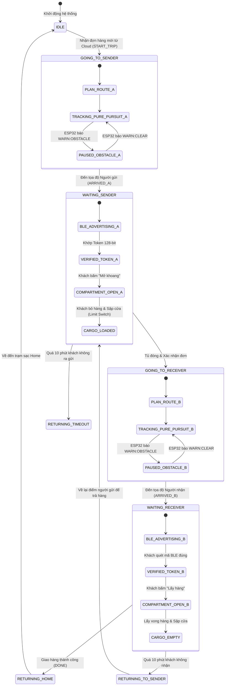
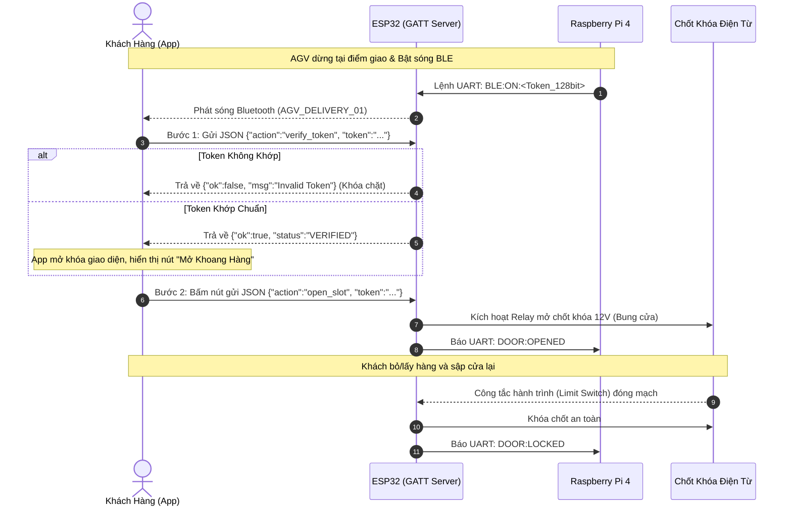
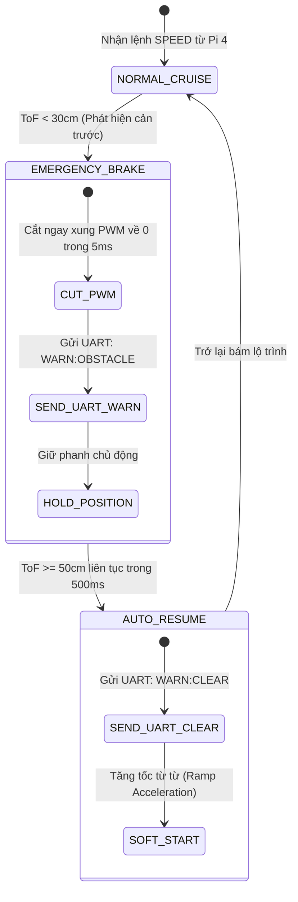

# Autonomous Delivery Robot (AGV) & IoT Fleet Dispatch Platform 🚚🤖

[-lightgrey?style=for-the-badge&logo=youtube&logoColor=red)](#2-field-trial-showcase--demo-video)
[%20%2B%20ESP32%20RTOS-blue?style=for-the-badge)](#3-system-architecture)
[](#6-embedded-software-engineering)
[](#5-engineering-design-decisions--trade-offs)
[](#10-build-flash--deployment-guide)

---

## 📑 Table of Contents (Mục Lục)
1. [System Overview (Tổng quan Hệ thống)](#1-system-overview-tổng-quan-hệ-thống)
2. [Field Trial Showcase & Demo Video (Tài liệu & Video Thực nghiệm)](#2-field-trial-showcase--demo-video-tài-liệu--video-thực-nghiệm)
3. [System Architecture (Cấu trúc Hệ thống)](#3-system-architecture-cấu-trúc-hệ-thống)
4. [Hardware Architecture & Electrical Diagram (Sơ đồ Khối Phần cứng & Phân phối Nguồn)](#4-hardware-architecture--electrical-diagram-sơ-đồ-khối-phần-cứng--phân-phối-nguồn)
5. [Engineering Design Decisions & Trade-offs (Giải thích Quyết định Thiết kế)](#5-engineering-design-decisions--trade-offs-giải-thích-quyết-định-thiết-kế)
6. [Embedded Software Engineering (Kỹ thuật Lập trình Nhúng Chuyên sâu)](#6-embedded-software-engineering-kỹ-thuật-lập-trình-nhúng-chuyên-sâu)
7. [Finite State Machines (Toàn bộ Máy Trạng thái Hữu hạn)](#7-finite-state-machines-toàn-bộ-máy-trạng-thái-hữu-hạn)
8. [End-to-End Operational Workflow (Luồng Hoạt động Chi tiết 5 Giai đoạn)](#8-end-to-end-operational-workflow-luồng-hoạt-động-chi-tiết-5-giai-đoạn)
9. [Hardware Wiring & Pin Mapping (Sơ đồ Nối chân Ngoại vi)](#9-hardware-wiring--pin-mapping-sơ-đồ-nối-chân-ngoại-vi)
10. [Build, Flash & Deployment Guide (Hướng dẫn Biên dịch & Triển khai)](#10-build-flash--deployment-guide-hướng-dẫn-biên-dịch--triển-khai)
11. [Source Code Structure & Git Conventions (Quy chuẩn Mã nguồn & Commit)](#11-source-code-structure--git-conventions-quy-chuẩn-mã-nguồn--commit)

---

## 1. System Overview (Tổng quan Hệ thống)

Dự án nghiên cứu và phát triển một hệ sinh thái **Robot Tự hành Giao hàng Ngoài trời (Outdoor Autonomous Delivery Robot)** toàn diện, giải quyết bài toán vận chuyển bưu kiện không tiếp xúc trong các khu đô thị/khuôn viên trường học (Campus Last-Mile Delivery):

1. **Client & Fleet Ecosystem:** Ứng dụng di động **Android** dành cho người gửi/nhận (tạo đơn, theo dõi hành trình GPS trực tiếp, xác thực mở khóa khoang hàng qua sóng Bluetooth BLE không chạm) và **Web Fleet Dashboard** (React 18 + Leaflet Map) giám sát toàn bộ đội xe cho ban quản trị.
2. **High-Level Navigator (Raspberry Pi 4):** Xử lý định vị toàn cầu GPS (U-blox Neo-M8N), nội suy lộ trình đường cong **Cubic Spline**, thuật toán bám quỹ đạo **Pure Pursuit**, giao tiếp MQTT hai chiều qua 4G/LTE và quản lý vòng đời đơn hàng.
3. **Real-Time Motion & Security Controller (ESP32 Dual-Core):** Chạy hệ điều hành thời gian thực **FreeRTOS (SMP)**, giải thuật dung hợp cảm biến **Madgwick AHRS (IMU + Compass)**, điều khiển kín vận tốc **Anti-Windup PID 200Hz**, quét laser ToF (VL53L0X) phanh khẩn cấp, và máy chủ xác thực bảo mật **BLE GATT Server**.

---

## 2. Field Trial Showcase & Demo Video (Tài liệu & Video Thực nghiệm)

> [!NOTE]
> Video thực nghiệm hiện trường ngoài trời (Field Trial) và kiểm thử lộ trình GPS đang được biên tập và sẽ cập nhật liên kết trực tiếp tại đây.

### Các kịch bản kiểm thử thực tế (Field Scenarios):
* 📍 **Scenario 1 - Spline GPS Navigation:** Robot nhận đơn hàng, nội suy lộ trình mượt mà và tự hành di chuyển giữa hai tọa độ GPS ngoài trời.
* 📍 **Scenario 2 - 2-Step Offline BLE Authentication:** Khách hàng đến gần xe trong cự ly 3 mét, ứng dụng Android tự động bắt cặp BLE, xác thực Token mã hóa 128-bit và bung chốt điện từ khoang hàng.
* 📍 **Scenario 3 - Laser ToF Emergency Braking:** Cắt toàn bộ lực kéo động cơ trong vòng dưới 5ms khi có người đi bộ hoặc chướng ngại vật xuất hiện đột ngột trong phạm vi $< 30\text{ cm}$.

---

## 3. System Architecture (Cấu trúc Hệ thống)

```
+---------------------------------------------------------------------------------------+
|                                    CLOUD & CLIENT TIER                                |
|  +--------------------------------+               +--------------------------------+  |
|  |     Android Mobile App         |               |     Web Fleet Dashboard        |  |
|  |     (Kotlin / Java)            |               |     (React 18 + Vite + Leaflet)|  |
|  |  - Tạo đơn & Tạo Token 128-bit |               |  - Theo dõi tọa độ GPS xe      |  |
|  |  - Theo dõi lộ trình thời gian |               |  - Điều phối đơn hàng tập trung|  |
|  |  - Mở tủ bằng BLE 2 bước      |               |  - Nhật ký sự kiện & Telemetry |  |
|  +----------------+---------------+               +----------------+---------------+  |
+-------------------|------------------------------------------------|------------------+
                    | HTTPS / WebSocket                              | REST / MQTT
+-------------------v------------------------------------------------v------------------+
|                             CLOUD BROKER & BACKEND LAYER                              |
|  - Firebase Realtime Database (Đồng bộ trạng thái đơn hàng & tọa độ toàn cục)         |
|  - Node.js (Express) Gateway Service (Cầu nối REST API & MQTT Mosquitto Broker)        |
+-------------------------------------------+-------------------------------------------+
                                            | MQTT over 4G-LTE / WiFi
                                            | Topics: agv/orders, agv/telemetry
+-------------------------------------------v-------------------------------------------+
|                        ROBOT HIGH-LEVEL CONTROLLER (RASPBERRY PI 4)                   |
|  +---------------------------------------------------------------------------------+  |
|  | [Navigation Core] Pure Pursuit Path Tracking & Spline Waypoint Smoothing        |  |
|  | [Sensor Fusion] Kalman Filter dung hợp GPS + Encoder Odometry + Góc Yaw IMU    |  |
|  | [Lifecycle FSM] Quản lý trạng thái đơn hàng (GOING_TO_A -> ARRIVED_A -> B...)   |  |
|  | [Network Manager] MQTT Client tự động khôi phục kết nối khi mất sóng            |  |
|  +----------------------------------------+----------------------------------------+  |
+-------------------------------------------|-------------------------------------------+
                                            | Full-Duplex USB-UART Serial (115200 bps)
                                            | Protocol: SPEED:vL:vR, ODO:tL:tR, WARN...
+-------------------------------------------v-------------------------------------------+
|                     ROBOT LOW-LEVEL REAL-TIME CONTROLLER (ESP32)                      |
|  +---------------------------------------------------------------------------------+  |
|  |                     FREERTOS DUAL-CORE MULTITASKING SCHEDULER                   |  |
|  |                                                                                 |  |
|  |  [CORE 0: Asynchronous & Connectivity]  |  [CORE 1: Hard Real-Time 200Hz]       |  |
|  |  - UART Packet Stream Parser từ Pi 4    |  - Dual Motor Closed-Loop PID Loop    |  |
|  |  - BLE GATT Server (2-Step Offline Auth)|  - Hardware PCNT Encoder Quadrature   |  |
|  |  - Khóa chốt điện từ & Limit Switch     |  - Madgwick AHRS Filter (IMU+Compass) |  |
|  |                                         |  - VL53L0X Laser ToF Scan (<30cm Stop)|  |
|  |                                         |                                       |  |
|  |  <====== Synchronized via FreeRTOS Mutex (Thread-Safe Shared Telemetry) ======>  |  |
|  +---------------------------------------------------------------------------------+  |
+---------------------------------------------------------------------------------------+
```

---

## 4. Hardware Architecture & Electrical Diagram (Sơ đồ Khối Phần cứng & Phân phối Nguồn)

Sơ đồ phân bổ nguồn công suất và đường tín hiệu bảo vệ trên Robot:

```
                          [ BỘ PIN NGUỒN 12V / 24V 10Ah Li-ion ]
                                          |
                      +-------------------+-------------------+
                      | (12V/24V Mạch Động Lực)               | (12V Điều Khiển)
                      v                                       v
         +--------------------------+            +--------------------------+
         | CẦU H CÔNG SUẤT CAO      |            | BUCK DC-DC 5V / 4A       |
         | (BTS7960 / MDD10A Dual)  |            | (Cấp nguồn Raspberry Pi) |
         +-------------+------------+            +------------+-------------+
                       |                                      | (5V 4A)
         +-------------+-------------+                        v
         | (Công suất PWM)           |               [ Raspberry Pi 4 Model B ]
         v                           v                        |
    [ MOTOR TRÁI ]              [ MOTOR PHẢI ]                |-- (USB) --> [ GPS U-blox NEO-M8N ]
    [ + Optical Enc ]           [ + Optical Enc ]             |-- (USB-UART CP2102) ----+
         |                           |                                                  |
         +-------------+-------------+                                                  |
                       | (Xung Kênh A/B Quadrature)                                     |
                       v                                                                |
         +--------------------------------------------------------------------+         |
         | BUCK DC-DC 5V/3.3V (Cấp nguồn Bo Vi Điều Khiển Nhúng)              |         |
         +---------------------------------+----------------------------------+         |
                                           | (5V)                                       |
                                           v                                            |
         +--------------------------------------------------------------------+         |
         |                 ESP32 DUAL-CORE RTOS CONTROLLER                    |<--------+
         |                                                                    |
         |--- (Hardware PCNT Unit 0/1) <--- [ Xung Encoder 2 Bánh Xe ]        |
         |--- (I2C Fast Mode 400kHz) -----> [ IMU MPU6050 + Compass QMC5883L ]|
         |--- (I2C Fast Mode 400kHz) -----> [ Cảm Biến Laser ToF VL53L0X ]    |
         |--- (GPIO Output 20kHz PWM) ----> [ Tín Hiệu Kích Cầu H BTS7960 ]   |
         |--- (GPIO Out + Relay 12V) -----> [ Chốt Khóa Điện Từ Khoang Hàng ] |
         |--- (GPIO In Pullup) -----------> [ Công Tắc Hành Trình Cửa Limit ] |
         |--- (2.4GHz RF Antenna) --------> [ Sóng Bluetooth BLE 4.2 GATT ]   |
         +--------------------------------------------------------------------+
```

### Điểm nhấn Thiết kế Điện - Phần cứng (Hardware Highlights):
1. **Cách ly tải động cơ công suất lớn:** Sử dụng mạch cầu H công suất cao (BTS7960 chịu dòng lên tới 43A) có optocoupler cách ly quang tích hợp, ngăn xung phản hồi ngược (Back-EMF) từ cuộn dây động cơ đánh hỏng chân GPIO của vi điều khiển.
2. **Khóa chốt điện từ có Diode dập xung (Flyback Diode):** Cuộn hút chốt khóa 12V sinh ra sức điện động cảm ứng rất lớn khi ngắt điện. Một diode 1N4007 được mắc song song ngược cực với cuộn dây để dập xung áp cao bảo vệ Relay và transistor kích.

---

## 5. Engineering Design Decisions & Trade-offs (Giải thích Quyết định Thiết kế)

### Decision 1: Tách biệt Raspberry Pi 4 (SBC) và ESP32 (Microcontroller) thay vì chạy trực tiếp trên Pi 4
* **Vấn đề:** Raspberry Pi 4 chạy hệ điều hành Linux (Non-Real-Time OS). Nhân Linux có cơ chế chia sẻ thời gian (Time-sharing) và phân rác bộ nhớ, dẫn đến hiện tượng trễ lập lịch (Scheduling Jitter) từ 5ms đến 50ms. Nếu xuất xung PWM hoặc đếm xung Encoder trực tiếp bằng chân GPIO của Pi 4, xung sẽ bị giật méo khi CPU bận xử lý mạng hoặc camera, dẫn đến lệch vận tốc và nguy cơ đâm va.
* **Quyết định:** Phân tầng phần cứng:
  * **Raspberry Pi 4:** Đóng vai trò "Bộ não" cấp cao (High-Level Intelligence): Xử lý thuật toán Pure Pursuit, giải phương trình động học vi phân, giao tiếp Cloud qua 4G và quản lý dữ liệu lớn.
  * **ESP32:** Đóng vai trò "Tiểu não" cơ sở (Hard Real-Time Executive): Chạy vòng lặp kín PID cố định chu kỳ **5ms (200Hz)**, giải mã xung phần cứng qua ngoại vi PCNT, và ngắt phanh khẩn cấp độc lập khi cảm biến Laser ToF phát hiện vật cản.

### Decision 2: Kiến trúc FreeRTOS Ghim Tác Vụ Đa Nhân (Task Pinning to Cores)
* **Vấn đề:** Khối sóng BLE và parser chuỗi UART từ Pi 4 chạy không đồng bộ (Asynchronous), có thể tốn thời gian xử lý khi nhận gói dữ liệu lớn. Nếu chạy chung một nhân với vòng lặp PID, tác vụ PID sẽ bị chiếm quyền điều khiển (Preempted), làm mất tính tiền định của chu kỳ lấy mẫu $\Delta t$.
* **Quyết định:** Cấu hình **FreeRTOS SMP Dual-Core**:
  * **Core 0 (Truyền thông & Kết nối):** Đảm nhiệm `Task_Comm` (hứng byte UART) và `Task_BLE` (máy chủ GATT xác thực mở tủ).
  * **Core 1 (Vòng lặp Kín 200Hz):** Dành trọn vẹn 100% CPU để chạy `Task_PID`, đọc bộ đếm xung PCNT và đọc cảm biến ToF. Sử dụng cơ chế `xTaskDelayUntil()` loại bỏ hiện tượng trôi chu kỳ lấy mẫu.
  * **Đồng bộ dữ liệu:** Hai nhân trao đổi thông tin thông qua **FreeRTOS Mutex** có cơ chế thừa kế độ ưu tiên (Priority Inheritance), triệt tiêu hoàn toàn Race Condition và Priority Inversion.

### Decision 3: Giải thuật Dung hợp Cảm biến Madgwick AHRS thay vì Lọc Bù Thông thường
* **Vấn đề:** Con quay hồi chuyển (Gyroscope) bị trôi góc tích phân theo thời gian (Drift). Cảm biến gia tốc chỉ đo được vector trọng trường khi đứng yên và bị nhiễu rung mạnh khi xe lăn bánh qua gờ giảm tốc. Bộ lọc bù (Complementary Filter) đơn giản không khử được nhiễu rung động học này, làm góc hướng (Yaw) bị lệch sau vài chục mét di chuyển.
* **Quyết định:** Triển khai giải thuật **Madgwick AHRS**:
  * Biểu diễn góc quay dưới dạng Quaternion 4 chiều, triệt tiêu hiện tượng khóa trục (Gimbal Lock).
  * Ứng dụng giải thuật Gradient Descent để tối ưu hóa hướng vector trọng lực và từ trường Trái Đất (QMC5883L), bù trừ sai số trôi góc của Gyroscope liên tục với sai số góc hướng $< 1.5^\circ$.

### Decision 4: Bộ điều khiển Vận tốc PID có Khâu Chống Bão Hòa Tích Phân (Anti-Windup Clamping)
* **Vấn đề:** Khi robot bắt đầu leo dốc hoặc chở tải hàng nặng, sai số vận tốc kéo dài làm thành phần tích phân ($I$) tích lũy tăng vọt đến mức cực đại. Khi xe đã đạt tốc độ mong muốn hoặc vừa qua đỉnh dốc, lượng tích lũy dư thừa này không xả kịp, khiến động cơ tiếp tục bơm công suất cực đại gây giật mạnh và vọt lố tốc độ (Overshoot).
* **Quyết định:** Tích hợp giải thuật **Anti-Windup Clamping**:
  $$I_{\text{term}}[k] = \text{constrain}(I_{\text{term}}[k-1] + K_i \cdot e[k] \cdot \Delta t, -I_{\text{max}}, I_{\text{max}})$$
  Tự động đóng băng việc tích lũy sai số khi ngõ ra PWM đã chạm ngưỡng bão hòa (255) và dấu của sai số cùng chiều với lực đẩy, giúp xe lăn bánh êm ái, bám sát vận tốc đặt từ Raspberry Pi.

### Decision 5: Quy trình Xác thực BLE 2 Bước Cục Bộ (2-Step Offline Authentication)
* **Vấn đề:** Nếu dùng cơ chế mở khóa hoàn toàn qua mạng 4G/Cloud, khi xe dừng giao hàng tại tầng hầm chung cư hoặc khu vực mất sóng viễn thông, khách hàng sẽ không thể mở tủ nhận hàng. Ngược lại, nếu dùng BLE đơn giản không bảo mật, kẻ xấu có thể sniff gói tin để mở trộm tủ.
* **Quyết định:** Thiết kế cơ chế **2-Step Token Handshake qua BLE GATT**:
  * Khi xuất phát, Pi 4 đã tải trước mã **Token 128-bit** ngẫu nhiên vào RAM của ESP32.
  * Tại điểm giao, khách hàng và xe kết nối trực tiếp qua Bluetooth trong bán kính 3 mét (hoàn toàn không cần kết nối Internet tại chỗ).
  * Bước 1: Khớp Token $\rightarrow$ Bước 2: Kích hoạt xung mở chốt điện. Cửa chỉ bung khi khách bấm nút trên App và đứng sát xe.

---

## 6. Embedded Software Engineering (Kỹ thuật Lập trình Nhúng Chuyên sâu)

### 6.1. Đa Nhiệm Đa Nhân Với FreeRTOS (Dual-Core SMP Architecture)
* **Task_PID (Core 1, Priority 5 - Cao nhất):** Chạy chu kỳ nghiêm ngặt 5ms (200Hz). Đọc thanh ghi phần cứng `PCNT`, tính sai số vận tốc, chạy Anti-Windup PID và xuất xung PWM qua module `LEDC` tần số 20kHz.
* **Task_ToF (Core 1, Priority 4):** Quét cảm biến laser VL53L0X. Đọc thanh ghi `RangeStatus == 0` (hợp lệ). Nếu khoảng cách $< 30\text{ cm}$, phát cờ phanh khẩn cấp `CUT_PWM` ngay trong chu kỳ hiện tại.
* **Task_Comm (Core 0, Priority 3):** Nhận stream byte UART từ Raspberry Pi, trích xuất chuỗi `SPEED:vL:vR` và cập nhật vào biến chia sẻ có Mutex bảo vệ.
* **Task_BLE (Core 0, Priority 2):** Khởi tạo BLE GATT Server, phát sóng quảng bá (Advertising) khi xe đến nơi và xử lý chuỗi JSON xác thực từ điện thoại.

---

## 7. Finite State Machines (Toàn bộ Máy Trạng thái Hữu hạn)

### 7.1. End-to-End Order Lifecycle State Machine (Raspberry Pi 4)



### 7.2. Quy Trình Xác Thực BLE 2 Bước Cục Bộ (2-Step BLE Security Sequence)



### 7.3. Máy Trạng Thái An Toàn Cự Ly Gần (ESP32 Laser Safety)



---

## 8. End-to-End Operational Workflow (Luồng Hoạt động Chi tiết 5 Giai đoạn)

### Giai đoạn 1: Khởi tạo Đơn & Di chuyển đến Người gửi
1. Người gửi A mở App Android, chọn vị trí Người nhận B. Hệ thống tự động sinh Token 128-bit và đồng bộ Firebase.
2. Raspberry Pi 4 nhận đơn qua MQTT, lưu Token vào bộ nhớ đệm cục bộ.
3. Thuật toán **Cubic Spline** làm mịn lộ trình GPS, bộ điều khiển **Pure Pursuit** tính vận tốc bánh và truyền xuống ESP32 qua UART: `SPEED:vL:vR`.
4. ESP32 thực thi vòng lặp Anti-Windup PID 200Hz điều khiển động cơ.

### Giai đoạn 2: Bỏ hàng vào Khoang
1. Đến điểm A, Pi 4 dừng xe (`SPEED:0:0`), bật sóng BLE.
2. Người gửi A lại gần trong bán kính 3m, App tự kết nối BLE và thực hiện quy trình **Xác thực 2 bước**.
3. Người gửi nhấn nút "Mở khoang", ESP32 bung chốt điện từ 12V. Người gửi bỏ hàng vào tủ và sập cửa lại. Công tắc hành trình xác nhận cửa đã khóa an toàn.

### Giai đoạn 3: Tự hành đến Người nhận
1. Pi 4 tắt BLE để bảo mật và tiết kiệm điện.
2. Xe di chuyển bằng Pure Pursuit kết hợp Kalman Filter dung hợp GPS, La bàn MPU/QMC và Encoder.
3. Cảm biến Laser ToF phía trước quét liên tục 200Hz. Nếu phát hiện cản $<30\text{ cm}$, ESP32 tự động cắt lực kéo phanh gấp độc lập với Pi 4 và báo `WARN:OBSTACLE`.

### Giai đoạn 4: Giao hàng cho Người nhận
1. Đến tọa độ B, Pi 4 phát lệnh dừng xe và bật lại sóng BLE.
2. Người nhận B ra xe thực hiện xác thực BLE 2 bước để mở tủ lấy hàng.
3. Cảm biến kiểm tra khoang hàng đã trống và cửa đã sập khóa an toàn. Đơn hàng chuyển sang trạng thái `COMPLETED`.

### Giai đoạn 5: Tự động về Trạm Sạc
1. Robot tự động tính toán lộ trình quay về trạm sạc gốc (Home Coordinates).
2. Khi về đến nơi, xe chuyển về trạng thái `IDLE` chờ đơn hàng tiếp theo.

---

## 9. Hardware Wiring & Pin Mapping (Sơ đồ Nối chân Ngoại vi)

### ESP32 (Low-Level Motion & Security Controller)
| Ngoại vi | Chân ESP32 | Chức năng Phần cứng | Ghi chú kỹ thuật |
| :--- | :---: | :--- | :--- |
| **Motor L - PWM** | `GPIO 25` | LEDC Channel 0 (PWM) | Tần số 20kHz, độ phân giải 8-bit |
| **Motor L - DIR** | `GPIO 26, GPIO 27` | GPIO Output Push-Pull | Chiều quay cầu H bánh trái |
| **Motor R - PWM** | `GPIO 14` | LEDC Channel 1 (PWM) | Tần số 20kHz, độ phân giải 8-bit |
| **Motor R - DIR** | `GPIO 12, GPIO 13` | GPIO Output Push-Pull | Chiều quay cầu H bánh phải |
| **Encoder Trái (A, B)**| `GPIO 34, GPIO 35` | Hardware PCNT Unit 0 | Đếm xung phần cứng 4x Quadrature |
| **Encoder Phải (A, B)**| `GPIO 36, GPIO 39` | Hardware PCNT Unit 1 | Đếm xung phần cứng 4x Quadrature |
| **I2C Bus (IMU / ToF)**| `GPIO 21 (SDA), GPIO 22 (SCL)`| Hardware I2C (400kHz Fast Mode) | Kết nối MPU6050, QMC5883L, VL53L0X |
| **Relay Khóa Tủ** | `GPIO 32` | GPIO Output | Điều khiển cuộn hút chốt điện từ 12V |
| **Công tắc Cửa** | `GPIO 33` | GPIO Input Pullup | Limit Switch nhận diện trạng thái cửa |
| **Serial to Pi 4** | `GPIO 16 (RX2), GPIO 17 (TX2)`| Hardware UART2 (115200 bps) | Giao tiếp lệnh & Telemetry với Pi 4 |

### Raspberry Pi 4 (High-Level Navigator)
| Cổng kết nối | Thiết bị Ngoại vi | Giao thức | Ghi chú kỹ thuật |
| :--- | :--- | :--- | :--- |
| **USB Port 1** | ESP32 Controller | USB-to-UART CP2102 | Nhận/Gửi lệnh điều khiển nhúng |
| **USB Port 2** | GPS U-blox Neo-M8N | NMEA Serial (9600 bps) | Dữ liệu vệ tinh GPS/GLONASS |
| **Network** | 4G-LTE Modem / WiFi | TCP/IP | Giao thức MQTT & Firebase Realtime |

---

## 10. Build, Flash & Deployment Guide (Hướng dẫn Biên dịch & Triển khai)

### Yêu cầu môi trường phát triển:
* [VS Code](https://code.visualstudio.com/) + Extension [PlatformIO IDE](https://platformio.org/).
* [Python](https://www.python.org/) 3.9+ trên Raspberry Pi 4.
* [Node.js](https://nodejs.org/) v18+ cho hệ thống Web Fleet Dashboard.
* [Android Studio](https://developer.android.com/studio) cho ứng dụng di động.

### 10.1. Nạp Firmware ESP32
```bash
cd robot/arduino_slave
# Biên dịch và nạp firmware qua cổng USB
pio run --target upload
```

### 10.2. Cài đặt & Khởi chạy Phần mềm Pi Master
```bash
cd robot/pi_master
# Cài đặt môi trường Python ảo
python3 -m venv venv
source venv/bin/activate
pip install -r requirements.txt

# Khởi chạy bộ điều phối trung tâm
python3 main.py
```

### 10.3. Khởi chạy Web Fleet Dashboard
```bash
# Khởi chạy nhanh bằng script tự động:
./web/start_web.bat

# Hoặc khởi chạy thủ công:
# Terminal 1: Backend
cd web/backend && npm install && npm start

# Terminal 2: Frontend
cd web/frontend && npm install && npm run dev
```

---

## 11. Source Code Structure & Git Conventions (Quy chuẩn Mã nguồn & Commit)

### Cấu trúc Thư mục Dự án
```
Autonomous-Delivery-Robot/
├── AutoDeliveryApp/           # Ứng dụng Android (Kotlin) - Đặt đơn, theo dõi GPS, xác thực BLE
├── robot/
│   ├── arduino_slave/         # Firmware ESP32 (FreeRTOS, PID 200Hz, Madgwick, BLE Server)
│   └── pi_master/             # Python Navigation Core (Pure Pursuit, GPS, Kalman, MQTT)
├── web/                       # Web Fleet Management Dashboard (React 18 + Express + Leaflet)
│   ├── backend/               # Gateway Service, MQTT Broker Client, REST APIs
│   └── frontend/              # Bản đồ giám sát tọa độ thời gian thực, điều phối xe
└── README.md                  # Tài liệu kỹ thuật chi tiết
```

### Quy chuẩn Git Commit (Conventional Commits)
Repository tuân thủ nghiêm ngặt chuẩn Conventional Commits:
* `feat:` Tính năng mới (ví dụ: `feat(esp32): add Madgwick AHRS filter for heading fusion`).
* `fix:` Sửa lỗi (ví dụ: `fix(pi): resolve Pure Pursuit waypoint lookahead overshoot`).
* `docs:` Tài liệu kỹ thuật (ví dụ: `docs(readme): add hardware block diagram and design decisions`).
* `refactor:` Tái cấu trúc mã nguồn (ví dụ: `refactor(rtos): modularize dual-core task creation`).

---
*Tác giả: **Phan Lê Thành Nguyên** — Kỹ sư Lập trình Nhúng & Tự động hóa.*
