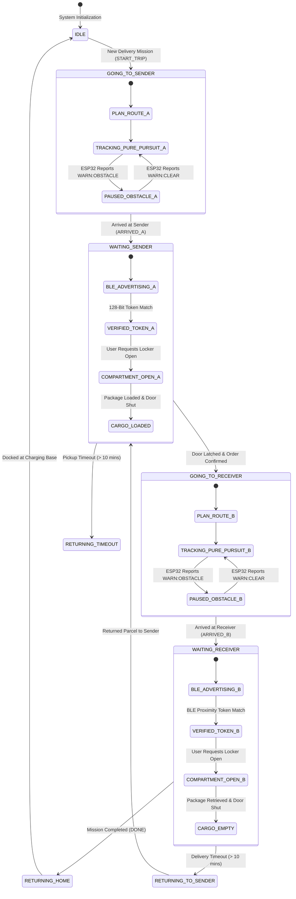
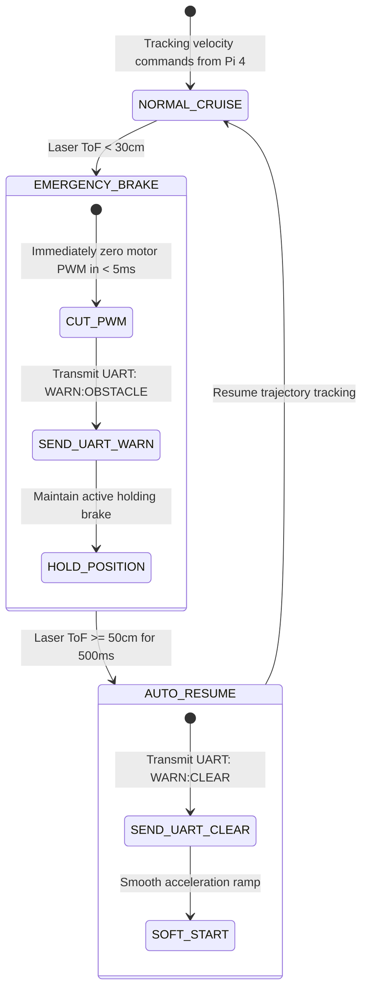

# Autonomous Delivery Robot (AGV) & IoT Fleet Dispatch Platform 🚚🤖

[-lightgrey?style=for-the-badge&logo=youtube&logoColor=red)](#2-field-trial-showcase--demo-video)
[%20%2B%20ESP32%20RTOS-blue?style=for-the-badge)](#3-system-architecture)
[](#6-embedded-software-engineering)
[](#5-engineering-design-decisions--trade-offs)
[](#10-build-flash--deployment-guide)

---

## 📑 Table of Contents
1. [System Overview](#1-system-overview)
2. [Field Trial Showcase & Demo Video](#2-field-trial-showcase--demo-video)
3. [System Architecture](#3-system-architecture)
4. [Hardware Architecture & Electrical Diagram](#4-hardware-architecture--electrical-diagram)
5. [Engineering Design Decisions & Trade-offs](#5-engineering-design-decisions--trade-offs)
6. [Embedded Software Engineering](#6-embedded-software-engineering)
7. [Finite State Machines](#7-finite-state-machines)
8. [End-to-End Operational Workflow](#8-end-to-end-operational-workflow)
9. [Hardware Wiring & Pin Mapping](#9-hardware-wiring--pin-mapping)
10. [Build, Flash & Deployment Guide](#10-build-flash--deployment-guide)
11. [Source Code Structure & Git Conventions](#11-source-code-structure--git-conventions)

---

## 1. System Overview

This project develops an autonomous, weather-resistant **Outdoor Autonomous Delivery Robot (AGV)** ecosystem engineered for contactless last-mile logistics within university campuses and corporate complexes:

1. **Client & Fleet Ecosystem:** Native **Android Application** for senders/receivers (order booking, live GPS route tracking, contactless proximity locker opening via BLE) and **Web Fleet Management Dashboard** (React 18 + Leaflet Map) for real-time fleet telematics and mission dispatching.
2. **High-Level Navigator (Raspberry Pi 4):** Manages global GNSS positioning (U-blox Neo-M8N), trajectory smoothing via **Cubic Spline**, path tracking using **Pure Pursuit**, bidirectional MQTT telemetry over 4G-LTE/WiFi, and mission lifecycle orchestration.
3. **Real-Time Motion & Security Controller (ESP32 Dual-Core):** Executes **FreeRTOS (SMP)** multi-threading, **Madgwick AHRS** sensor fusion (9-DoF IMU + Magnetometer), deterministic **Anti-Windup PID** closed-loop velocity control at 200Hz, sub-millisecond laser obstacle detection (VL53L0X ToF), and a local **BLE GATT Security Server**.

---

## 2. Field Trial Showcase & Demo Video

> [!NOTE]
> Physical outdoor field-trial recordings and GNSS trajectory validation videos are currently being cataloged and will be linked directly here upon release.

### Verified Test Scenarios:
* 📍 **Scenario 1 - Spline GPS Navigation:** The AGV accepts dispatch waypoints from the cloud broker, generates continuous spline-smoothed trajectories, and tracks target GPS coordinates outdoors.
* 📍 **Scenario 2 - 2-Step Offline BLE Authentication:** Customers approach within a 3-meter radius; the Android app performs local BLE handshake, validates a 128-bit cryptographic token, and actuates the 12V solenoid locker lock without requiring cellular internet.
* 📍 **Scenario 3 - Laser ToF Emergency Braking:** Autonomous motor cut-off in $<5\text{ ms}$ upon obstacle detection within $30\text{ cm}$, preventing collision regardless of high-level SBC processing latency.

---

## 3. System Architecture

```
+---------------------------------------------------------------------------------------+
|                                    CLOUD & CLIENT TIER                                |
|  +--------------------------------+               +--------------------------------+  |
|  |     Android Mobile App         |               |     Web Fleet Dashboard        |  |
|  |     (Kotlin / Java)            |               |     (React 18 + Vite + Leaflet)|  |
|  |  - Order Dispatch & 128-bit Key|               |  - Real-Time AGV Telemetry Map |  |
|  |  - Live GPS Navigation Feed    |               |  - Centralized Fleet Dispatch  |  |
|  |  - Proximity 2-Step BLE Unlock |               |  - System Health & Event Logs  |  |
|  +----------------+---------------+               +----------------+---------------+  |
+-------------------|------------------------------------------------|------------------+
                    | HTTPS / WebSocket                              | REST / MQTT
+-------------------v------------------------------------------------v------------------+
|                             CLOUD BROKER & BACKEND LAYER                              |
|  - Firebase Realtime Database (Order state synchronization & global GPS telemetry)    |
|  - Node.js (Express) Gateway Service (REST API bridge & Mosquitto MQTT Broker)        |
+-------------------------------------------+-------------------------------------------+
                                            | MQTT over 4G-LTE / WiFi
                                            | Topics: agv/orders, agv/telemetry
+-------------------------------------------v-------------------------------------------+
|                        ROBOT HIGH-LEVEL CONTROLLER (RASPBERRY PI 4)                   |
|  +---------------------------------------------------------------------------------+  |
|  | [Navigation Core] Pure Pursuit Path Tracking & Spline Waypoint Interpolation   |  |
|  | [Sensor Fusion] Extended Kalman Filter fusing GPS + Wheel Odometry + Yaw IMU   |  |
|  | [Lifecycle FSM] Order Lifecycle Manager (GOING_TO_A -> ARRIVED_A -> B...)       |  |
|  | [Network Manager] Resilient MQTT Client with auto-reconnect & packet caching   |  |
|  +----------------------------------------+----------------------------------------+  |
+-------------------------------------------|-------------------------------------------+
                                            | Full-Duplex USB-UART Serial (115200 bps)
                                            | Protocol: SPEED:vL:vR, ODO:tL:tR, WARN...
+-------------------------------------------v-------------------------------------------+
|                     ROBOT LOW-LEVEL REAL-TIME CONTROLLER (ESP32)                      |
|  +---------------------------------------------------------------------------------+  |
|  |                     FREERTOS DUAL-CORE MULTITASKING SCHEDULER                   |  |
|  |                                                                                 |  |
|  |  [CORE 0: Asynchronous & Connectivity]  |  [CORE 1: Hard Real-Time 200Hz]       |  |
|  |  - UART Packet Stream Parser from Pi 4  |  - Dual Motor Closed-Loop PID Loop    |  |
|  |  - BLE GATT Server (2-Step Offline Auth)|  - Hardware PCNT Encoder Quadrature   |  |
|  |  - Solenoid Lock Relay & Limit Switch   |  - Madgwick AHRS Filter (IMU+Compass) |  |
|  |                                         |  - VL53L0X Laser ToF Scan (<30cm Stop)|  |
|  |                                         |                                       |  |
|  |  <====== Synchronized via FreeRTOS Mutex (Thread-Safe Shared Telemetry) ======>  |  |
|  +---------------------------------------------------------------------------------+  |
+---------------------------------------------------------------------------------------+
```

---

## 4. Hardware Architecture & Electrical Diagram

The electrical power distribution tree isolates high-current actuator transients from delicate computation processors:

```
                          [ 12V / 24V 10Ah LI-ION BATTERY PACK ]
                                          |
                      +-------------------+-------------------+
                      | (12V/24V Actuator Power Rail)         | (12V Logic Supply)
                      v                                       v
         +--------------------------+            +--------------------------+
         | HIGH-POWER MOTOR DRIVER  |            | DC-DC BUCK 5V / 4A       |
         | (BTS7960 / MDD10A Dual)  |            | (Raspberry Pi Power Rail)|
         +-------------+------------+            +------------+-------------+
                       |                                      | (5V 4A)
         +-------------+-------------+                        v
         | (High-Current PWM)        |               [ Raspberry Pi 4 Model B ]
         v                           v                        |
    [ LEFT MOTOR ]              [ RIGHT MOTOR ]               |-- (USB) --> [ U-blox NEO-M8N GPS ]
    [ + Optical Enc ]           [ + Optical Enc ]             |-- (USB-UART CP2102) ----+
         |                           |                                                  |
         +-------------+-------------+                                                  |
                       | (Quadrature Channel A/B Pulses)                                |
                       v                                                                |
         +--------------------------------------------------------------------+         |
         | DC-DC BUCK 5V/3.3V (Dedicated Embedded Microcontroller Rail)       |         |
         +---------------------------------+----------------------------------+         |
                                           | (5V)                                       |
                                           v                                            |
         +--------------------------------------------------------------------+         |
         |                 ESP32 DUAL-CORE RTOS CONTROLLER                    |<--------+
         |                                                                    |
         |--- (Hardware PCNT Unit 0/1) <--- [ Dual Wheel Quadrature Encoders ]|
         |--- (I2C Fast Mode 400kHz) -----> [ IMU MPU6050 + Compass QMC5883L ]|
         |--- (I2C Fast Mode 400kHz) -----> [ VL53L0X Laser ToF Rangefinder ] |
         |--- (GPIO Output 20kHz PWM) ----> [ BTS7960 Motor Driver Logic ]    |
         |--- (GPIO Out + 12V Relay) -----> [ Cargo Compartment Solenoid Lock]|
         |--- (GPIO In Pullup) -----------> [ Limit Switch (Door Interlock) ] |
         |--- (2.4GHz RF Antenna) --------> [ BLE 4.2 GATT Proximity Link ]   |
         +--------------------------------------------------------------------+
```

### Electrical Design Features:
1. **Optically Isolated Motor H-Bridges:** High-current BTS7960 bridges (rated up to 43A) feature built-in optocouplers on all logic input pins, shielding the ESP32 GPIOs from inductive motor back-EMF transients.
2. **Flyback Diode Suppression:** The 12V cargo compartment solenoid lock is clamped with a reverse-biased 1N4007 flyback diode across the inductive coil, dissipating high-voltage inductive discharge when the relay de-energizes.

---

## 5. Engineering Design Decisions & Trade-offs

### Decision 1: Split Architecture (Raspberry Pi 4 + ESP32) vs. Single SBC Control
* **Problem:** Raspberry Pi 4 runs a standard multi-tasking Linux OS with non-real-time kernel scheduling. Interrupt latency jitter ranges from 5ms to 50ms during heavy background I/O or cellular transmission. Generating high-frequency PWM or sampling quadrature encoder interrupts directly from the Pi's GPIO pins leads to severe velocity jitter, pulse loss, and navigation drift.
* **Trade-off Decision:**
  * **Raspberry Pi 4 (High-Level Intelligence):** Runs Pure Pursuit path-following algorithms, cubic spline trajectory generation, GPS coordinate transformations, and cloud networking.
  * **ESP32 (Hard Real-Time Executive):** Runs a jitter-free **5ms (200Hz)** PID velocity loop, hardware-level pulse counting (`PCNT`), and autonomous sub-millisecond obstacle emergency braking via laser ToF.

### Decision 2: FreeRTOS SMP Task Pinning (`Core 0` vs. `Core 1`)
* **Problem:** BLE cryptographic handshakes and serial UART string parsing exhibit non-deterministic runtimes. If scheduled on the same CPU core as the motor velocity PID controller, task preemption can disrupt the control period $\Delta t$.
* **Trade-off Decision:** Pinned multi-core architecture via `xTaskCreatePinnedToCore`:
  * **Core 0 (Asynchronous Tasks):** `Task_Comm` (UART stream parser) and `Task_BLE` (GATT security server).
  * **Core 1 (Deterministic Hard Real-Time):** `Task_PID` running at 200Hz with `vTaskDelayUntil()`, hardware encoder reading, and laser safety monitoring.
  * Thread-safe inter-core data sharing is guarded by **FreeRTOS Mutexes with Priority Inheritance**, preventing priority inversion.

### Decision 3: Madgwick AHRS Sensor Fusion vs. Standard Complementary Filter
* **Problem:** Standard 6-DoF complementary filters drift severely over extended travel distances due to uncompensated gyroscope integration errors and transient accelerations during acceleration/braking.
* **Trade-off Decision:** Implemented the **Madgwick AHRS Algorithm**:
  * Represents 3D orientation in 4-dimensional quaternions, eliminating Gimbal Lock.
  * Dynamically computes gradient descent optimization against Earth’s gravitational vector (MPU6050) and geomagnetic field (QMC5883L), bounding heading error below **$<1.5^\circ$**.

### Decision 4: Anti-Windup Clamping on Closed-Loop PID Velocity Control
* **Problem:** When climbing curbs or navigating inclines under payload, sustained tracking error causes the integral accumulator ($I$) to saturate. Once flat ground is reached, the surplus accumulated value causes massive overshoot and violent mechanical jerk.
* **Trade-off Decision:** Incorporated an **Anti-Windup Clamping Integrator**:
  $$I_{\text{term}}[k] = \text{constrain}(I_{\text{term}}[k-1] + K_i \cdot e[k] \cdot \Delta t, -I_{\text{max}}, I_{\text{max}})$$
  Integration is clamped when the PWM output saturates (255) and the error shares the same sign as the output, ensuring smooth motor actuation.

### Decision 5: Two-Step Proximity Offline BLE Authentication vs. Cloud-Only Unlock
* **Problem:** Cloud-only locker unlock mechanisms fail whenever the robot stops in cellular dead zones (e.g., covered archways, building basements). Conversely, unauthenticated local buttons permit cargo theft.
* **Trade-off Decision:** Engineered a **2-Step Offline Token Handshake over BLE GATT**:
  * Pi 4 pre-caches a random **128-bit cryptographic token** into ESP32 RAM at dispatch.
  * At delivery, the customer connects via BLE within 3 meters without needing active cellular internet.
  * Step 1 validates the token; Step 2 actuates the solenoid lock only when the user explicitly triggers "Open Locker" on the mobile app.

---

## 6. Embedded Software Engineering

### 6.1. FreeRTOS Dual-Core Multitasking Architecture
* **Task_PID (Core 1, Priority 5):** Hard real-time 5ms loop (200Hz). Samples hardware `PCNT` registers, computes Anti-Windup PID corrections, and drives 20kHz `LEDC` PWM channels.
* **Task_ToF (Core 1, Priority 4):** Evaluates VL53L0X status register (`RangeStatus == 0`). Triggers immediate motor cutoff if distance $<30\text{ cm}$.
* **Task_Comm (Core 0, Priority 3):** Deserializes incoming `SPEED:vL:vR` frames from the Pi and formats outgoing telemetry frames (`ODO:tL:tR`).
* **Task_BLE (Core 0, Priority 2):** Manages BLE GATT Server advertising and JSON authentication payload parsing.

---

## 7. Finite State Machines

### 7.1. End-to-End Order Lifecycle State Machine (Raspberry Pi 4)



### 7.2. Two-Step Proximity BLE Security Handshake

```mermaid
sequenceDiagram
    autonumber
    actor User as Customer (Mobile App)
    participant BLE as ESP32 (GATT Server)
    participant Pi as Raspberry Pi 4
    participant Lock as Solenoid Latch

    Note over User,Pi: AGV stops at waypoint & initiates BLE broadcast
    Pi->>BLE: Serial Frame: BLE:ON:<Token_128bit>
    BLE-->>User: BLE Advertisement (AGV_DELIVERY_01)
    
    User->>BLE: Step 1: Send JSON {"action":"verify_token", "token":"..."}
    alt Token Mismatch
        BLE-->>User: Return {"ok":false, "msg":"Invalid Token"}
    else Token Match Verified
        BLE-->>User: Return {"ok":true, "status":"VERIFIED"}
        Note over User: App unlocks "Open Compartment" UI button
    end
    
    User->>BLE: Step 2: User taps button -> {"action":"open_slot", "token":"..."}
    BLE->>Lock: Energize 12V Relay (Door opens)
    BLE->>Pi: Serial Frame: DOOR:OPENED
    
    Note over User,Lock: Package loaded/unloaded; door is closed
    Lock-->>BLE: Limit Switch contacts close
    BLE->>Lock: De-energize solenoid (Securely locked)
    BLE->>Pi: Serial Frame: DOOR:LOCKED
```

### 7.3. Laser Proximity Emergency Safety State Machine



---

## 8. End-to-End Operational Workflow

### Stage 1: Order Initiation & Dispatch
1. Sender creates a shipment on the Android app, designating receiver dropoff coordinates. The cloud service issues a random 128-bit cryptographic key and syncs to Firebase.
2. Raspberry Pi 4 receives dispatch over MQTT, caching the authentication token locally.
3. The **Cubic Spline** algorithm smooths waypoints, and the **Pure Pursuit** controller calculates differential wheel velocity setpoints (`SPEED:vL:vR`).
4. ESP32 runs the 200Hz closed-loop Anti-Windup PID controller to track target velocity.

### Stage 2: Parcel Loading at Sender Location
1. Upon arriving at Point A, Pi 4 stops the vehicle and activates BLE advertising.
2. Sender approaches within 3m; the Android app performs the 2-step BLE authentication handshake.
3. Sender presses "Open Locker"; the 12V solenoid energizes. The parcel is placed inside, and the door is latched. The limit switch confirms closed status to ESP32 and Pi 4.

### Stage 3: Autonomous Transit to Destination
1. BLE advertising is deactivated for security and power conservation.
2. AGV tracks outdoor waypoints via Pure Pursuit, fusing GNSS, magnetometer, and encoder data via an Extended Kalman Filter.
3. The forward-facing VL53L0X laser sensor scans at 200Hz. Any obstacle within $<30\text{ cm}$ triggers immediate, autonomous motor braking.

### Stage 4: Parcel Handover to Receiver
1. At Point B, Pi 4 halts the vehicle and reactivates BLE broadcast.
2. Receiver completes the 2-step BLE handshake to retrieve the shipment.
3. Internal optical sensors confirm the locker is empty, and the door is re-locked. Order state transitions to `COMPLETED`.

### Stage 5: Autonomous Return to Home Base
1. The AGV computes the shortest path back to the home charging station.
2. Upon docking, the robot transitions to `IDLE` mode, awaiting subsequent mission dispatch.

---

## 9. Hardware Wiring & Pin Mapping

### ESP32 (Low-Level Motion & Security Controller)
| Peripheral Device | ESP32 Pin | Hardware Function | Technical Specification |
| :--- | :---: | :--- | :--- |
| **Motor L - PWM** | `GPIO 25` | LEDC Channel 0 (PWM) | 20kHz, 8-bit resolution |
| **Motor L - DIR** | `GPIO 26, GPIO 27` | GPIO Output Push-Pull | Left motor direction logic |
| **Motor R - PWM** | `GPIO 14` | LEDC Channel 1 (PWM) | 20kHz, 8-bit resolution |
| **Motor R - DIR** | `GPIO 12, GPIO 13` | GPIO Output Push-Pull | Right motor direction logic |
| **Encoder Left (A, B)**| `GPIO 34, GPIO 35` | Hardware PCNT Unit 0 | 4x Quadrature pulse counting |
| **Encoder Right (A, B)**| `GPIO 36, GPIO 39` | Hardware PCNT Unit 1 | 4x Quadrature pulse counting |
| **I2C Bus (IMU / ToF)**| `GPIO 21 (SDA), GPIO 22 (SCL)`| Hardware I2C (400kHz Fast Mode) | MPU6050, QMC5883L, VL53L0X |
| **Locker Relay** | `GPIO 32` | GPIO Output | 12V Solenoid driver circuit |
| **Door Limit Switch** | `GPIO 33` | GPIO Input Pullup | Contact closure detection |
| **Serial to Pi 4** | `GPIO 16 (RX2), GPIO 17 (TX2)`| Hardware UART2 (115200 bps) | Bidirectional framing link |

### Raspberry Pi 4 (High-Level Navigator)
| Interface Port | Peripheral Device | Protocol | Technical Specification |
| :--- | :--- | :--- | :--- |
| **USB Port 1** | ESP32 Controller | USB-to-UART CP2102 | Serial telemetry & velocity commands |
| **USB Port 2** | GPS U-blox Neo-M8N | NMEA Serial (9600 bps) | Multi-GNSS satellite positioning |
| **Network** | 4G-LTE Modem / WiFi | TCP/IP | MQTT & Firebase Realtime Database |

---

## 10. Build, Flash & Deployment Guide

### Prerequisites:
* [VS Code](https://code.visualstudio.com/) with the [PlatformIO IDE](https://platformio.org/) extension.
* [Python](https://www.python.org/) 3.9+ on Raspberry Pi OS.
* [Node.js](https://nodejs.org/) v18+ for the Web Fleet Dashboard.
* [Android Studio](https://developer.android.com/studio) for the mobile client.

### 10.1. Flashing ESP32 Firmware
```bash
cd robot/arduino_slave
# Compile and flash firmware via USB-UART
pio run --target upload
```

### 10.2. Raspberry Pi Navigator Setup
```bash
cd robot/pi_master
# Create and activate virtual environment
python3 -m venv venv
source venv/bin/activate
pip install -r requirements.txt

# Launch central mission navigator
python3 main.py
```

### 10.3. Launching Web Fleet Dashboard
```bash
# Automated launch script (Windows):
./web/start_web.bat

# Manual launch:
# Terminal 1: Backend Gateway
cd web/backend && npm install && npm start

# Terminal 2: Frontend Web App
cd web/frontend && npm install && npm run dev
```

---

## 11. Source Code Structure & Git Conventions

### Repository Layout
```
Autonomous-Delivery-Robot/
├── AutoDeliveryApp/           # Native Android App (Kotlin) - Booking, GPS feed, BLE unlock
├── robot/
│   ├── arduino_slave/         # ESP32 Firmware (FreeRTOS, 200Hz PID, Madgwick, BLE Server)
│   └── pi_master/             # Python Navigation Core (Pure Pursuit, GPS, Kalman, MQTT)
├── web/                       # Web Fleet Management Dashboard (React 18 + Express + Leaflet)
│   ├── backend/               # Gateway Service, MQTT Broker Client, REST APIs
│   └── frontend/              # Live telemetry map, fleet mission management
└── README.md                  # Comprehensive Technical System Specification
```

### Git Commit Conventions
All commits strictly adhere to the Conventional Commits standard:
* `feat:` Introduces a new feature (`feat(esp32): add Madgwick AHRS filter for orientation fusion`).
* `fix:` Patches a bug (`fix(pi): resolve Pure Pursuit waypoint lookahead overshoot`).
* `docs:` Documentation updates (`docs(readme): add hardware electrical diagram and design decisions in English`).
* `refactor:` Code reorganization without behavioral modifications (`refactor(rtos): modularize dual-core task creation`).

---
*Author: **Phan Le Thanh Nguyen** — Embedded Systems & Automation Engineer.*
