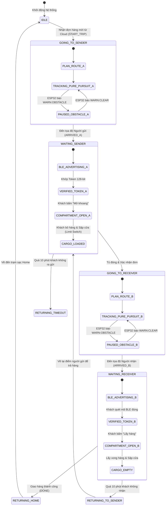
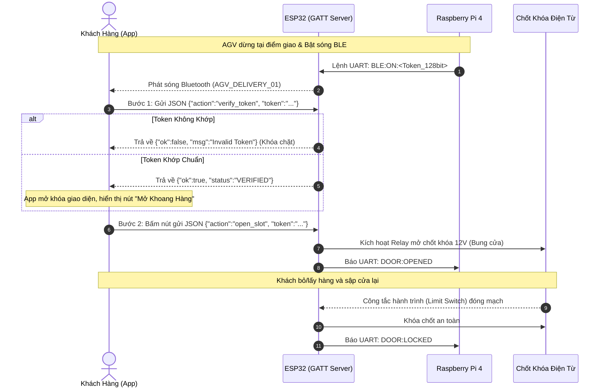
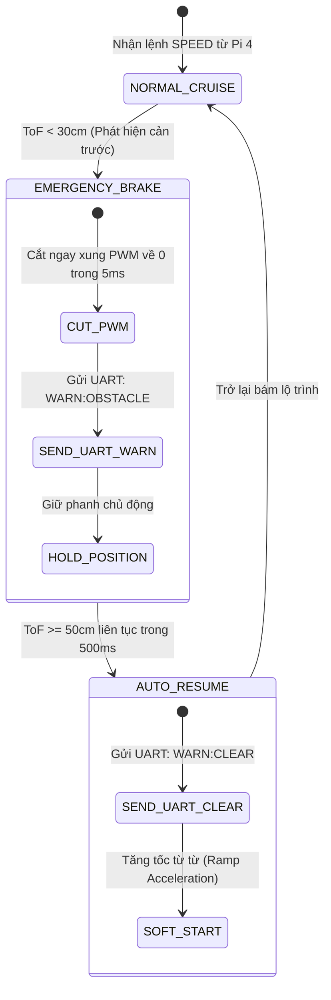

# Autonomous Delivery Robot (AGV) & IoT Fleet Dispatch Platform 🚚🤖

[](#embedded-software-engineering)
[](#system-architecture)
[](#sensor-fusion--motion-control)
[](#cloud--mobile-app-integration)

---

## 1. System Overview (Tổng quan Hệ thống)

Dự án nghiên cứu và phát triển một hệ sinh thái **Robot Tự hành Giao hàng Ngoài trời (Outdoor Autonomous Delivery Robot)** hoàn chỉnh, kết hợp giữa phần cứng nhúng thời gian thực, thuật toán dẫn đường vệ tinh và nền tảng quản lý đội xe thông minh trên Cloud:

1. **Client Ecosystem:** Ứng dụng di động **Android** dành cho khách hàng (tạo đơn, theo dõi hành trình GPS trực tiếp, mở khóa khoang hàng qua sóng Bluetooth không chạm) và **Web Dashboard** giám sát toàn bộ đội xe cho ban quản trị.
2. **High-Level Navigator (Raspberry Pi 4):** Xử lý định vị toàn cầu GPS (U-blox Neo-M8N), nội suy lộ trình Spline, thuật toán bám đường **Pure Pursuit**, giao tiếp MQTT hai chiều và quản lý vòng đời đơn hàng.
3. **Real-Time Motion Controller (ESP32 Dual-Core):** Chạy hệ điều hành thời gian thực **FreeRTOS (SMP)**, giải thuật dung hợp cảm biến **Madgwick AHRS**, điều khiển vận tốc kín **Anti-Windup PID**, quét laser ToF (VL53L0X) tránh vật cản tức thời, và máy chủ xác thực bảo mật **BLE GATT Server**.

---

## 2. System Architecture (Cấu trúc Hệ thống)

```
+---------------------------------------------------------------------------------------+
|                                    CLOUD & CLIENT TIER                                |
|  +--------------------------------+               +--------------------------------+  |
|  |     Android Mobile App         |               |     Web Fleet Dashboard        |  |
|  |     (Kotlin / Java)            |               |     (React 18 + Vite + Leaflet)|  |
|  |  - Tạo đơn & Tạo Token 128-bit |               |  - Theo dõi tọa độ GPS xe      |  |
|  |  - Theo dõi lộ trình thời gian |               |  - Điều phối đơn hàng tập trung|  |
|  |  - Mở tủ bằng BLE 2 bước      |               |  - Nhật ký sự kiện & Telemetry |  |
|  +----------------+---------------+               +----------------+---------------+  |
+-------------------|------------------------------------------------|------------------+
                    | HTTPS / WebSocket                              | REST / MQTT
+-------------------v------------------------------------------------v------------------+
|                             CLOUD BROKER & BACKEND LAYER                              |
|  - Firebase Realtime Database (Đồng bộ trạng thái đơn hàng & tọa độ toàn cục)         |
|  - Node.js (Express) Gateway Service (Cầu nối REST API & MQTT Mosquitto Broker)        |
+-------------------------------------------+-------------------------------------------+
                                            | MQTT over 4G-LTE / WiFi
                                            | Topics: agv/orders, agv/telemetry
+-------------------------------------------v-------------------------------------------+
|                        ROBOT HIGH-LEVEL CONTROLLER (RASPBERRY PI 4)                   |
|  +---------------------------------------------------------------------------------+  |
|  | [Navigation Core] Pure Pursuit Path Tracking & Spline Waypoint Smoothing        |  |
|  | [Sensor Fusion] Kalman Filter dung hợp GPS + Encoder Odometry + Góc Yaw IMU    |  |
|  | [Lifecycle FSM] Quản lý trạng thái đơn hàng (GOING_TO_A -> ARRIVED_A -> B...)   |  |
|  | [Network Manager] MQTT Client tự động khôi phục kết nối khi mất sóng            |  |
|  +----------------------------------------+----------------------------------------+  |
+-------------------------------------------|-------------------------------------------+
                                            | Full-Duplex USB-UART Serial (115200 bps)
                                            | Protocol: SPEED:vL:vR, ODO:tL:tR, WARN...
+-------------------------------------------v-------------------------------------------+
|                     ROBOT LOW-LEVEL REAL-TIME CONTROLLER (ESP32)                      |
|  +---------------------------------------------------------------------------------+  |
|  |                     FREERTOS DUAL-CORE MULTITASKING SCHEDULER                   |  |
|  |                                                                                 |  |
|  |  [CORE 0: Asynchronous & Connectivity]  |  [CORE 1: Hard Real-Time 200Hz]       |  |
|  |  - UART Packet Stream Parser từ Pi 4    |  - Dual Motor Closed-Loop PID Loop    |  |
|  |  - BLE GATT Server (2-Step Offline Auth)|  - Hardware PCNT Encoder Quadrature   |  |
|  |  - Khóa chốt điện từ & Limit Switch     |  - Madgwick AHRS Filter (IMU+Compass) |  |
|  |                                         |  - VL53L0X Laser ToF Scan (<30cm Stop)|  |
|  |                                         |                                       |  |
|  |  <====== Synchronized via FreeRTOS Mutex (Thread-Safe Shared Telemetry) ======>  |  |
|  +---------------------------------------------------------------------------------+  |
+---------------------------------------------------------------------------------------+
```

---

## 3. Embedded Software Engineering (Điểm Nhấn Kỹ Thuật Nhúng)

### 3.1. Đa Nhiệm Đa Nhân Với FreeRTOS (Dual-Core SMP Architecture)
Vi điều khiển ESP32 được cấu hình phân tách tác vụ triệt để giữa 2 nhân phần cứng thông qua `xTaskCreatePinnedToCore`:
* **Core 0 (Asynchronous Tasks):**
  * `Task_Comm`: Hứng luồng byte từ UART kết nối với Raspberry Pi, giải mã gói lệnh `SPEED` và đóng gói bản tin `ODO` gửi ngược lên.
  * `Task_BLE`: Khởi tạo BLE GATT Server, phát sóng quảng bá (Advertising) khi xe đến đích, tiếp nhận luồng xác thực JSON từ điện thoại của khách hàng.
* **Core 1 (Deterministic Hard Real-Time 200Hz Loop):**
  * Dành trọn vẹn 100% tài nguyên CPU để chạy vòng lặp điều khiển kín với chu kỳ nghiêm ngặt **5ms (200Hz)** dùng `vTaskDelayUntil()`.
  * Đọc thanh ghi ngoại vi đếm xung phần cứng **PCNT (Pulse Counter)**, tính toán đạo hàm sai số và xuất xung PWM điều khiển mạch cầu H.

### 3.2. Đồng Bộ Hóa Dữ Liệu & Triệt Tiêu Race Condition
Giữa Core 0 (Nhận lệnh từ Pi) và Core 1 (Thực thi PID) tồn tại cấu trúc dữ liệu dùng chung `VehicleState` (chứa vận tốc mục tiêu, xung encoder, trạng thái cản ToF, góc la bàn):
* Sử dụng **FreeRTOS Mutex** (`xSemaphoreCreateMutex()`) để bảo vệ các vùng tranh chấp tài nguyên (Critical Sections).
* Tích hợp cơ chế **Priority Inheritance** (Thừa kế độ ưu tiên) nhằm ngăn chặn triệt để hiện tượng **Priority Inversion** khi Task cấp thấp đang giữ khóa bị ngắt bởi Task trung bình.

### 3.3. Giải Thuật Sensor Fusion Madgwick AHRS
Để xe di chuyển chính xác trên lộ trình dài ngoài trời, góc định hướng (Yaw) không thể chỉ dựa vào Gyroscope (do bị trôi dạt tích phân - Gyro Drift):
* Thuật toán **Madgwick Filter** được triển khai bằng ngôn ngữ C++ tối ưu số thực dấu phẩy động.
* Thuật toán kết hợp vận tốc góc từ Gyroscope (MPU6050) với vector trường gia tốc Trái Đất và vector từ trường la bàn số (QMC5883L) để liên tục bù trừ sai số trôi góc, duy trì góc hướng la bàn tuyệt đối với sai số $< 1.5^\circ$.

### 3.4. Bộ Điều Khiển Vận Tốc Kín Với Anti-Windup Clamping
Khi xe vượt dốc nghiêng hoặc chở tải nặng, sai số vận tốc kéo dài làm khâu tích phân ($I$) bị tích lũy vượt ngưỡng bão hòa:
* Lập trình giải thuật **Anti-Windup Clamping**:
  $$I_{term}[k] = \text{constrain}(I_{term}[k-1] + K_i \cdot e[k] \cdot \Delta t, -I_{max}, I_{max})$$
* Tự động đóng băng việc tích lũy sai số khi ngõ ra PWM đã chạm ngưỡng cực đại (255) mà dấu của sai số vẫn cùng chiều với lực đẩy, triệt tiêu hoàn toàn hiện tượng vọt lố (Overshoot) và giật quán tính khi xe vượt qua chướng ngại vật.

### 3.5. Đọc Thanh Ghi Trạng Thái Phần Cứng Cảm Biến Laser ToF
Cảm biến đo cự ly Laser VL53L0X hoạt động qua bus I2C:
* Phần mềm trực tiếp đọc thanh ghi trạng thái phần cứng `RangeStatus`. Chỉ khi `RangeStatus == 0` (Dữ liệu hợp lệ), khoảng cách mới được đưa vào máy trạng thái.
* Loại bỏ các tín hiệu lỗi quang học do bề mặt bóng kính (Specular reflection) hoặc lệch pha (Phase Fail), ngăn chặn tình trạng phanh ảo khi chạy ngoài trời nắng.

---

## 4. State Machines (Toàn Bộ Máy Trạng Thái Hữu Hạn)

### 4.1. End-to-End Order Lifecycle State Machine (Raspberry Pi 4)



### 4.2. Quy Trình Xác Thực BLE 2 Bước Không Chạm (2-Step BLE Security FSM)



### 4.3. Máy Trạng Thái An Toàn & Tránh Vật Cản Cự Ly Gần (ESP32)



---

## 5. End-to-End Operational Workflow (Chi Tiết 5 Giai Đoạn)

### Giai đoạn 1: Khởi tạo Đơn & Xe di chuyển tới Người gửi
1. Khách hàng A tạo đơn hàng trên ứng dụng Android: Chọn vị trí Người nhận B. Ứng dụng sinh ngẫu nhiên mã khóa bảo mật **Token 128-bit** độc lập và đồng bộ lên Firebase.
2. Máy chủ Node.js phát bản tin MQTT thông báo có đơn hàng mới.
3. Raspberry Pi 4 tiếp nhận đơn, lưu `Token` vào bộ nhớ đệm cục bộ (sẵn sàng xác thực offline cả khi xe xuống hầm mất mạng).
4. Thuật toán **Spline** làm mịn các mốc GPS thành chuỗi Waypoints li ti. Bộ điều khiển **Pure Pursuit** tính toán vận tốc bánh trái/phải và gửi liên tục xuống ESP32: `SPEED:v_left:v_right`.
5. ESP32 thực thi điều khiển động cơ qua vòng lặp Anti-Windup PID 200Hz.

### Giai đoạn 2: Đến điểm đón & Bỏ hàng vào xe
1. Đến tọa độ A, Pi 4 dừng xe (`SPEED:0:0`), gửi UART lệnh bật sóng BLE: `BLE:ON:<Token>`.
2. Khách A nhận thông báo đẩy (Push Notification), tiến lại gần xe và mở ứng dụng:
   * **Bước 1 (Xác thực tiệm cận):** App kết nối BLE và truyền gói JSON `{"action":"verify_token"}`. ESP32 so sánh với mã Token lưu trong RAM. Nếu đúng, phản hồi `{"ok":true}` mà không bung chốt cửa.
   * **Bước 2 (Mở chốt vật lý):** Màn hình hiển thị nút "Mở khoang hàng". Khách A bấm nút $\rightarrow$ App gửi `{"action":"open_slot"}`. ESP32 kích Relay mở chốt khóa 12V.
3. Khách A bỏ gói hàng vào tủ và sập cửa lại. Cảm biến hành trình (Limit Switch) báo về ESP32. ESP32 gửi UART `DOOR:LOCKED` cho Pi 4.

### Giai đoạn 3: Hành trình di chuyển tới Người nhận
1. Pi 4 tắt hoàn toàn sóng BLE trên ESP32 để tiết kiệm pin và đảm bảo bảo mật trên đường đi.
2. Pi 4 tính toán lộ trình tới tọa độ Người nhận B. Xe di chuyển bằng Pure Pursuit kết hợp bộ lọc Kalman dung hợp dữ liệu GPS, La bàn MPU/QMC và Encoder.
3. *Tránh vật cản:* Cảm biến Laser ToF phía trước xe liên tục quét 200Hz. Nếu phát hiện chướng ngại vật bất ngờ cự ly $< 30$cm, ESP32 tự động cắt lực kéo phanh gấp độc lập với Pi 4 và báo cờ cảnh báo `WARN:OBSTACLE`.

### Giai đoạn 4: Giao hàng cho Người nhận
1. Đến điểm giao B, Pi 4 phát lệnh dừng xe, bật lại sóng BLE và nạp `Token`.
2. Người nhận B ra xe và thực hiện quy trình **Xác thực 2 bước (2-Step BLE Verification)** tương tự Giai đoạn 2 để mở tủ lấy hàng.
3. Cảm biến quang ToF đáy tủ kiểm tra khoang hàng đã thực sự trống và cửa đã được sập khóa an toàn. Pi 4 cập nhật trạng thái đơn hàng trên Cloud là `COMPLETED`.

### Giai đoạn 5: Tự động quay về trạm sạc
1. Xe tự động tính toán lộ trình quay về tọa độ xuất phát (Trạm sạc Home).
2. Khi về đến trạm, xe chuyển sang trạng thái `IDLE` và ngắt các ngoại vi tiêu thụ điện để sạc pin.

---

## 6. Hardware Wiring & Pin Mapping (Sơ Đồ Đấu Dây)

### ESP32 (Low-Level Motion & Security Controller)
| Ngoại vi | Chân ESP32 | Chức năng | Ghi chú |
| :--- | :---: | :--- | :--- |
| **Motor L - PWM** | `GPIO 25` | LEDC Channel 0 (20kHz PWM) | Tốc độ bánh trái |
| **Motor L - DIR** | `GPIO 26, GPIO 27` | GPIO Output | Chiều quay bánh trái |
| **Motor R - PWM** | `GPIO 14` | LEDC Channel 1 (20kHz PWM) | Tốc độ bánh phải |
| **Motor R - DIR** | `GPIO 12, GPIO 13` | GPIO Output | Chiều quay bánh phải |
| **Encoder Trái (A, B)**| `GPIO 34, GPIO 35` | Hardware PCNT Unit 0 | Đếm xung phần cứng Quadrature |
| **Encoder Phải (A, B)**| `GPIO 36, GPIO 39` | Hardware PCNT Unit 1 | Đếm xung phần cứng Quadrature |
| **I2C Bus (IMU / ToF)**| `GPIO 21 (SDA), GPIO 22 (SCL)`| Hardware I2C (400kHz Fast Mode) | MPU6050, QMC5883L, VL53L0X |
| **Relay Khóa Tủ** | `GPIO 32` | GPIO Output | Điều khiển chốt điện từ 12V |
| **Công tắc Cửa** | `GPIO 33` | GPIO Input Pullup | Limit Switch nhận diện đóng/mở |
| **Serial to Pi 4** | `GPIO 16 (RX2), GPIO 17 (TX2)`| Hardware UART2 (115200 bps) | Giao tiếp lệnh & Telemetry |

### Raspberry Pi 4 (High-Level Navigator)
| Cổng kết nối | Thiết bị | Giao thức | Ghi chú |
| :--- | :--- | :--- | :--- |
| **USB Port 1** | ESP32 Controller | USB-to-UART CP2102 | Nhận/Gửi lệnh điều khiển nhúng |
| **USB Port 2** | GPS U-blox Neo-M8N | NMEA Serial (9600 bps) | Tọa độ vệ tinh toàn cầu |
| **Network** | 4G-LTE Modem / WiFi | TCP/IP | Kết nối MQTT & Firebase |

---

## 7. Build & Deployment Guide (Hướng Dẫn Triển Khai)

### 7.1. Nạp Firmware ESP32
```bash
cd robot/arduino_slave
# Biên dịch và nạp firmware qua cổng USB
pio run --target upload
```

### 7.2. Cài đặt & Khởi chạy Phần mềm Pi Master
```bash
cd robot/pi_master
# Cài đặt môi trường Python ảo
python3 -m venv venv
source venv/bin/activate
pip install -r requirements.txt

# Khởi chạy bộ điều phối trung tâm
python3 main.py
```

### 7.3. Khởi chạy Web Dashboard
```bash
# Khởi chạy nhanh bằng file script:
./web/start_web.bat

# Hoặc khởi chạy thủ công:
# Terminal 1: Backend
cd web/backend && npm install && npm start

# Terminal 2: Frontend
cd web/frontend && npm install && npm run dev
```

---
*Tác giả: **Phan Lê Thành Nguyên** — Kỹ sư Nhúng & Tự động hóa.*
